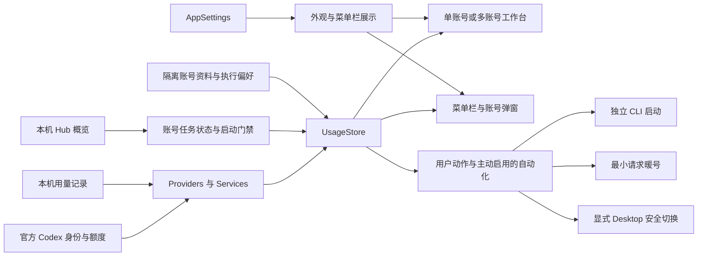

# Codex Account Manager Next 架构

当前产品基线为 0905v3。本文只描述 Next 的现有结构；安装与能力范围以 [README](README.md) 为准，安全约束以 [SECURITY](SECURITY.md) 为准。

## 主要关系

## 代码分层

| 目录 | 职责 |
| --- | --- |
| `App/` | 生命周期、窗口、菜单栏与全局快捷键 |
| `Domain/` | 额度窗口、执行偏好、占用策略、身份与展示模型、自测 |
| `Providers/` | Runtime 适配与数据来源选择 |
| `Services/` | 读取、持久化、官方接口、Hub 状态与安全事务 |
| `UI/` | 原生 SwiftUI/AppKit 展示与用户交互 |
| `Resources/` | 图标、配色契约、本地化与第三方许可证 |
| `scripts/` | 构建、测试、资源与发布检查 |

以上生产代码位于 `Sources/CodexUsageWidget/`。历史目录名、配色 ID 和 Windows 包名属于内部兼容标识，不代表当前产品品牌，也不能为改名而破坏已有设置。

## 账号与任务

单账号和多账号共用身份与额度模型。同一身份的系统入口与隔离入口去重，单账号只收起无意义的批量控件。

每个独立账号保存模型、思考强度与速度。后续 CLI 启动命令携带主任务与默认子 Agent 参数，不改写系统 Codex 配置；已运行任务不被中途修改。

Hub 是外部服务。Next 读取任务状态，不创建 Hub 任务。只有可信账号映射、新鲜概览与可用状态均成立时，Next 的任务入口才开放。这里仍存在检查到启动的竞态，不是跨进程原子租约。

## 暖号与切换是不同事务

暖号默认关闭。启用后先读取身份与额度，检查 Hub 空闲状态，再发送最小请求并读取最新额度。会消耗额度，不会兑换重置券，不会切换 Desktop。

Desktop 切换必须显式触发，沿用身份验证、锁、优雅退出、原子写入、写后验证、回滚与恢复流程。独立 CLI 不走 Desktop 切号路径。

## 设置与证据

设置只有外观、菜单栏、自动化、工作区、关于五个直达分区。视图使用共享 AppSettings 与已有回调，不维护第二份业务状态。

[24 张公开图片](docs/images/0905v3/README.md)均由隔离演示数据渲染。截图不证明真实登录、暖号、任务派发或通知发送成功。纯测试、真实运行与公开安装包分别记录，不能相互替代。

Windows 工作区仍保留，不宣称与 macOS 的账号管理能力等价。见 [Windows 范围](windows/README.md)。
