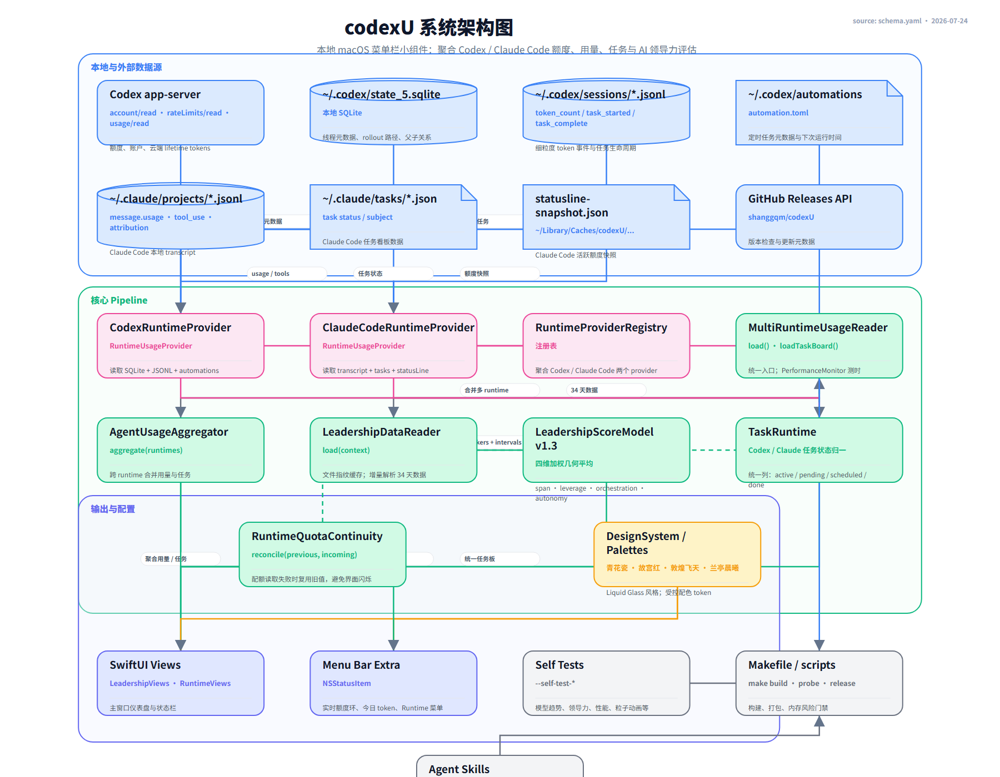

# codexU 架构蓝图

## 一、系统架构图



架构图源文件都在 [`docs/architecture/`](docs/architecture/)：

- [`schema.yaml`](docs/architecture/schema.yaml) —— **真值**，改架构改这个
- [`diagram.svg`](docs/architecture/diagram.svg) —— 确定性 renderer 生成的可编辑主图
- [`diagram.png`](docs/architecture/diagram.png) —— 展示图，通过浏览器从 HTML 渲染（Windows 无原生 Cairo）
- [`diagram.html`](docs/architecture/diagram.html) —— 可选预览页
- [`diagram.mmd`](docs/architecture/diagram.mmd) —— Mermaid fallback，粘到 [mermaid.live](https://mermaid.live) 可看
- [`render.py`](docs/architecture/render.py) —— 项目本地 renderer

这些 view 必须与 schema 保持一致。改架构先改 schema，然后同步 Mermaid fallback，最后重跑 renderer。

---

## 二、一句话定位

codexU 是一个**本地优先、隐私优先**的 macOS 菜单栏与桌面应用。它把 OpenAI Codex / ChatGPT Codex 和 Claude Code 的额度、token 用量、今日任务和本机 AI 劳动力评估，整合到一个入口，帮助用户快速判断剩余额度、重置时间、当天工作进展，以及一个人正在调动多少 AI 劳动力。

---

## 三、模块定义

### 3.1 外部数据源

| 模块 | 职责 | 输入 | 输出 | 非目标 |
|---|---|---|---|---|
| `Codex app-server` | 读取官方账户与额度 API | 本地 `codex app-server` | 额度窗口、账户类型、重置时间 | 不读取或上传线程正文 |
| `~/.codex/state_5.sqlite` | 本地 SQLite 元数据 | Codex 运行产生的数据库 | 线程列表、rollout 路径、父子关系、automation 标记 | 不替代 JSONL 细粒度事件 |
| `~/.codex/sessions/*.jsonl` | 细粒度 token 与任务事件 | Codex rollout JSONL | `token_count`、`task_started`、`task_complete` | 不加载整个文件到内存 |
| `~/.codex/automations/**/automation.toml` | 定时任务元数据 | Codex automation 配置 | 下次运行时间、周期 | 规则不完整时不猜测 |
| `~/.claude/projects/*.jsonl` | Claude Code transcript | Claude Code 会话记录 | `message.usage`、`tool_use`、Skill attribution | 不提供模型归因 |
| `~/.claude/tasks/*.json` | Claude Code 任务状态 | Claude Code task 文件 | 进行中/待处理/计划中/已完成 | 不跨 runtime 混用状态语义 |
| `statusline-snapshot.json` | Claude Code 活跃额度 | `~/Library/Caches/codexU/claude-code/` | 5h/7d 额度快照 | 缺失时显示 `--` |
| `GitHub Releases API` | 版本检查 | 公开 release 元数据 | 最新版本、DMG 下载入口 | 不静默下载或自动安装 |

### 3.2 Runtime Provider 层

| 模块 | 职责 | 接口 | 输入 | 输出 |
|---|---|---|---|---|
| `CodexRuntimeProvider` | 读取 Codex 官方与本地数据 | `RuntimeUsageProvider` | SQLite、JSONL、automation、app-server | `RuntimeUsageSnapshot` |
| `ClaudeCodeRuntimeProvider` | 读取 Claude Code 本地数据 | `RuntimeUsageProvider` | transcript、tasks、statusLine、`.claude.json` | `RuntimeUsageSnapshot` |
| `RuntimeProviderRegistry` | 管理 provider 注册 | 注册表 | provider 集合 | 按 `RuntimeScope` 路由 |

### 3.3 核心聚合与评估层

| 模块 | 职责 | 接口/算法 | 输入 | 输出 |
|---|---|---|---|---|
| `MultiRuntimeUsageReader` | 统一数据加载入口 | `load()` / `loadTaskBoard()` | `RuntimeProviderRegistry`、`StatisticsTimeZonePreference` | `MultiRuntimeUsageSnapshot` |
| `AgentUsageAggregator` | 跨 runtime 合并用量 | `aggregate(runtimes, at:)` | 多个 `RuntimeUsageSnapshot` | 聚合后的 `UsageSnapshot` |
| `TaskRuntime` | 统一任务状态语义 | 分类器 | Codex / Claude 原始任务状态 | `active / pending / scheduled / done` |
| `RuntimeQuotaContinuity` | 防止额度界面闪烁 | `reconcile(previous, incoming)` | 上一次与本次 snapshot | 复用旧配额并标记 `stale` |
| `LeadershipDataReader` | 读取并缓存领导力证据 | `load(context)` | Codex/Claude 34 天源数据 | `LeadershipParsedSource` 数组 |
| `LeadershipScoreModel v1.3` | 计算 AI 领导力得分 | 四维加权几何平均 | workers + intervals | `LeadershipDashboardSnapshot` |

### 3.4 UI 与配置层

| 模块 | 职责 | 输入 | 输出 |
|---|---|---|---|
| `DesignSystem / Palettes` | 受控配色与设计 token | 青花瓷、故宫红、敦煌飞天、兰亭晨曦等 palette JSON | SwiftUI 颜色、环境值 |
| `SwiftUI Views` | 主窗口仪表盘 | `MultiRuntimeUsageSnapshot` | 额度环、趋势图、任务板、AI 领导力 |
| `Menu Bar Extra` | 状态栏实时扫视 | `RuntimeMenuSummary` | 额度环、今日 token、Runtime 菜单 |

### 3.5 基础设施

| 模块 | 职责 |
|---|---|
| `Makefile / scripts` | 构建、探针、内存风险门禁、双架构 DMG 打包 |
| `Self Tests` | 运行时自测：`--self-test-token-counter`、`--self-test-leadership-model` 等 |
| `Agent Skills` | 项目级 Skill：`codexu-pr-review`、`codexu-release` |

---

## 四、数据契约

### 4.1 RuntimeUsageSnapshot

```swift
RuntimeUsageSnapshot {
  scope: RuntimeScope          // codex | claudeCode
  snapshot: UsageSnapshot       // 账户、额度、本地用量、任务板
  status: RuntimeMenuStatus     // available | localOnly | snapshotNeeded | stale | unavailable
  quotaSourceLabel: String      // 额度来源说明
  usageSourceLabel: String      // 用量来源说明
}
```

### 4.2 LocalUsage

```swift
LocalUsage {
  lifetimeTokens, todayTokens, sevenDayTokens: Int64
  threadCount: Int
  lastUpdatedAt: Date?
  dailyBuckets: [DailyTokenBucket]       // 最近 7 天
  recentThreads: [LocalThread]
  detailedUsage: DetailedUsage?          // 今日/7天/月/累计 + token 拆分
  usageTrend: UsageTrend?                // 180 天热力图 + 模型趋势
  projectBoard: ProjectBoard?
  toolUsages: [ToolUsage]
  skillUsages: [SkillUsage]
}
```

### 4.3 AI 领导力报告

```swift
LeadershipReport {
  period: LeadershipPeriod              // today | sevenDays | twentyEightDays
  score: Int?                            // 0–100，默认 28 天
  coreScore: Double?
  title: LeadershipTitle?                // 七级称号
  dimensions: [LeadershipDimension]      // span / leverage / orchestration / autonomy
  maturity: Double                       // 活跃天数成熟度
  evidenceCoverage: Double               // 证据可信度覆盖
  agentCount, aiHours, peakConcurrency: ...
  dailyPoints: [LeadershipDayPoint]
  projects: [LeadershipProjectContribution]
}
```

---

## 五、关键设计选择

1. **本地优先，隐私优先**
   - 所有 usage、线程、路径、日志、账户数据均不上传。
   - GitHub Release 检查只读取公开 release 元数据，不携带本机信息。

2. **双 Runtime 合并，但不混用语义**
   - Codex 与 Claude Code 各自有独立 `RuntimeUsageProvider`。
   - 聚合层合并 token 与任务，但任务状态列按各自 runtime 的真实语义分类。

3. **增量解析 + 文件指纹缓存**
   - Claude transcript 使用 v2 磁盘缓存：`session-usage-v1.json`，按文件大小 + 修改时间纳秒指纹命中。
   - AI 领导力源数据同样使用指纹缓存，避免每次全量解析 JSONL。

4. **流式读取，限制内存**
   - JSONL 解析按 64KB chunk 流式读取，单行上限 4MB，缓存上限 128MB。
   - SQLite 输出上限 32MB，管道读取上限 64KB/次。

5. **配额连续性（Quota Continuity）**
   - 当 Codex app-server 临时不可用时，复用上一次的额度窗口并标记 `stale`，避免主界面与菜单栏数字跳动。

6. **可信度分层**
   - AI 领导力只让 `fact` 与 `derived` 证据进入得分，`estimated` 区间不计分但独立展示。

7. **几何平均抑制刷分**
   - `coreScore` 采用四维加权几何平均，防止单一维度（例如只堆 agent 数）刷出高分。

---

## 六、当前状态 / Known Gaps

- [x] `schema.yaml`、`diagram.mmd`、`diagram.svg`、`diagram.html`、`diagram.png` 已生成。
- [x] `render.py` 已复制到项目本地。
- [ ] 未生成 `diagram.excalidraw`（如需要人工协作编辑可后续补充）。
- [ ] 未生成 `model.c4` / `model.likec4`（系统规模当前适中，可后续按需补充）。
- [ ] Windows 环境下 PNG 通过浏览器截图 fallback 生成；macOS 可改用 `cairosvg` 原生渲染。

---

## 七、相关文档

- [`README.md`](README.md) —— 产品说明与使用指南
- [`AGENTS.md`](AGENTS.md) —— 长期协作规范与项目边界
- [`RESEARCH.md`](RESEARCH.md) —— 数据口径与回退策略
- [`DISTRIBUTION.md`](DISTRIBUTION.md) —— 打包、签名与发布流程
- [`docs/DESIGN_SYSTEM.md`](docs/DESIGN_SYSTEM.md) —— UI 与设计系统约束
