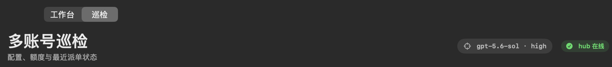
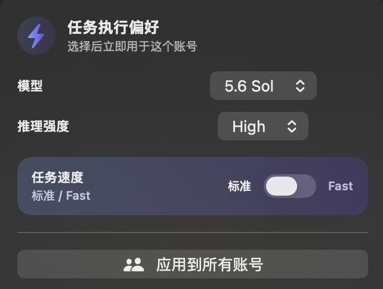
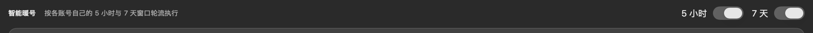
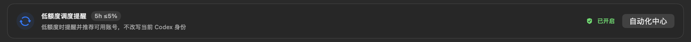
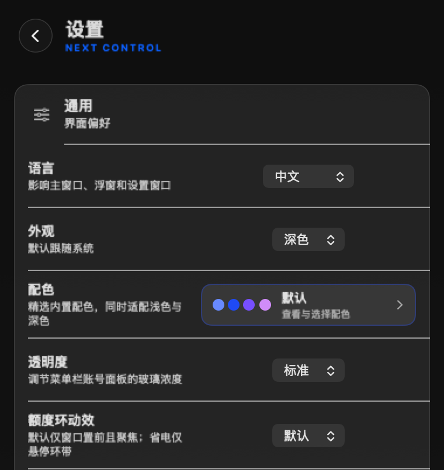

# Codex Account Manager Next

[中文](README.md) | **English**

[](https://github.com/BLACKIELF/codex-account-manager-next/actions/workflows/ci.yml)


[](LICENSE)

A local-first macOS workspace for multiple Codex accounts: inspect official quota, keep account homes isolated, choose a model/reasoning effort/speed per independent account, launch an isolated CLI, and reduce duplicate-use risk by blocking new starts from this app when a fresh Hub overview reports the mapped account busy.

Current formal version: `0904v2` · `9.4.2 (12)`. This is not an official OpenAI product. It does not provide accounts, increase quota, or bypass login, MFA, or platform restrictions.



> These images come from the locally built 0904v2 app and are privacy-safe, pixel-preserving crops of Retina 2× captures; wide details reach 2340 px. They retain only feature controls and contain no real account alias, email, quota, token total, subscription, reset time, credential, webhook, task body, or private local path.

## What changed in 0904v2

- Added the blue-purple Execution Preference control. Each independent account can select a model, reasoning effort, and Standard/Fast speed, or apply one setting to every independent account.
- Use in Terminal writes the selection into the launch command. Default subagents launched by that CLI inherit the same model and reasoning effort.
- Account cards and Inspection poll Hub every 10 seconds and show approval, starting, working, cancellation, uncertain, and terminal states.
- When Hub reports the account as busy, is offline, or becomes stale, terminal entry is disabled; a clicked warm-up is rejected by its execution gate.
- Replaced the fixed-timeout CLI warm-up subprocess with a bounded direct SSE request to the ChatGPT Codex backend endpoint, preserving classified diagnostics.
- A new active quota window supersedes an old warm-up failure. A failed idle window is not consumed repeatedly.

See [CHANGELOG.md](CHANGELOG.md) for full history.

## Feature map

| Area | Available now |
|---|---|
| Workbench | Monitored account, 5-hour/7-day quota, reset times, official lifetime tokens, local all-agent tokens, and cost estimate |
| Account card | Refresh, Warm Up, dispatch participation, execution preference, isolated CLI, monitoring, re-login, Chrome session, and explicit Desktop switch |
| Inspection | Model configuration, quota, Hub state, dispatch-disabled accounts, stale snapshots, low quota, and configuration drift |
| Automation Center | Low-quota account recommendations, Feishu notifications, safety gates, and recent audit events |
| Menu bar and Settings | Quota ring, density, language, theme, palettes, shortcut, always-on-top, background residency, and update checks |

The current full window has two top-level pages: Workbench and Inspection. Historical view code and the Windows workspace remain in the repository, but they do not imply equivalent entry points in the current macOS product.

## Five common account actions with different boundaries

| Action | Purpose | Uses quota | Changes Desktop identity | Hub gate |
|---|---|---:|---:|---:|
| Refresh | Read official identity, quota, and reset time | No | No | Idle not required |
| Warm Up | Send one minimal `hi` request with that account, then refresh quota | Yes | No | Trusted mapping, fresh overview, and no active task for the alias |
| Use in Terminal | Start Codex CLI under that account's isolated `CODEX_HOME` | The task does | No | Trusted mapping, fresh overview, and no active task for the alias |
| Re-authenticate | Update the target profile's local credential through the official page | No | System profile only | Not a task-occupancy entry point |
| Switch Desktop | Replace the account currently used by the Codex app | No | **Yes** | Uses a separate safe-switch transaction |

Low-quota automation exposes no launch or switch action. It displays a candidate in-app and writes a local audit event, plus an optional masked Feishu notification when enabled. The user must return to that account card to start CLI manually, where the generic terminal entry performs its own Hub checks.

## Per-account execution preference



Each independent account stores one execution preference. A change immediately affects later CLI launches and their default subagents without editing the account's `config.toml`.

| Model | Reasoning efforts | Speed |
|---|---|---|
| `gpt-5.6-sol` | Low / Medium / High / XHigh / Max / Ultra | Standard / Fast |
| `gpt-5.6-terra` | Low / Medium / High / XHigh / Max / Ultra | Standard / Fast |
| `gpt-5.6-luna` | Low / Medium / High / XHigh / Max | Standard / Fast |
| `gpt-5.5` | Low / Medium / High / XHigh | Standard / Fast |
| `gpt-5.2` | Low / Medium / High / XHigh | Standard |

The default is `gpt-5.6-sol + high + Standard`. Unsupported combinations are rejected without replacing the last valid setting. Apply to All is a one-time overwrite; accounts can still be adjusted individually afterward.

Propagation covers the primary model and effort, default subagent model and effort, and Standard/Fast service tier. If Hub creates work through another entry point, that dispatcher must explicitly reuse the generated command or the same parameter set; Next currently reads Hub state but does not create Hub tasks. Warm-up is a separate maintenance action fixed to lightweight `gpt-5.6-luna`; it does not reuse task execution preference.

## Hub task state and duplicate-use risk control

Next reads local Hub overview from `http://127.0.0.1:8787/api/overview` and maps tasks by account dispatch alias:

- Polling interval: 10 seconds.
- An overview older than 30 seconds is stale.
- Active phases: Awaiting Approval, Starting, Work in Progress, Requesting Cancellation, and Status Uncertain.
- Success, failure, or cancellation remains visible for about two minutes, then returns to Idle.
- If Hub is offline, returns an unknown state, lacks the account alias, or becomes stale, Next fails closed: terminal entry is disabled, and warm-up is rejected when its execution gate runs.
- Entry points reopen when a fresh overview has no active task for the trusted alias, or only a terminal state remains.

This is account occupancy coordination and status feedback, not an in-app remote task console or an atomic lease. A race remains between checking and starting, so external dispatchers must follow the same Hub occupancy protocol. Next does not take over the central identity, create Hub tasks, or silently switch the current Codex account.

### Hub integration prerequisites

Hub coordination in 0904v2 is an externally provisioned integration. There is no mapping editor in the app, and a public source build does not discover account aliases or create these files automatically.

Provision the account-card dispatch code and Hub alias before the app starts:

```text
~/Library/Application Support/CodexAccountManagerNext/dispatch-codes-v1.json
```

```json
{
  "schemaVersion": 1,
  "accounts": [
    {
      "code": "A",
      "alias": "account-a",
      "profileId": "<managed-profile-id>"
    }
  ]
}
```

`code` must be a unique single letter from `A` through `Z`; `alias` and `profileId` must be nonempty. The process reads this file once at startup, so restart Next after changing it.

Inspection reads a separate account list from external Hub configuration. Its default file is:

```text
~/Library/Application Support/CodexAccountManagerNext/inspection-config-v1.json
```

Alternatively, set `CAMNEXT_INSPECTION_CONFIG` in the **app process environment** to another JSON file with this shape:

```json
{
  "accounts": [
    {
      "alias": "account-a",
      "home": "/absolute/path/to/account/CODEX_HOME",
      "dispatchDisabled": false
    }
  ]
}
```

`home` must point to that account's isolated `CODEX_HOME`. Inspection derives the Profile ID from the directory name and read-only parses `model` and `model_reasoning_effort` from its `config.toml`. A normal Finder launch does not invent process environment variables, so the default Application Support file is usually the practical choice. A missing or unreadable Inspection configuration affects only the Inspection page; account-card CLI/warm-up fail closed when the dispatch mapping is missing, Hub is offline, or its overview is stale. Next neither writes these external configurations nor submits work through the Hub API.

## Accounts and browser login

- Every independently managed account uses a Next-owned isolated `CODEX_HOME` and credential snapshot; the system profile still represents the user's active `~/.codex`.
- On first add or re-authentication, bind an existing Chrome profile or use a persistent account-specific Chrome session.
- The official page still handles login, passwords, cookies, and MFA. Next does not read or bypass them.
- Stable Account ID and masked email are verified after login to reject duplicate or mismatched identities.
- Notes, ordering, monitored-account selection, and moving local account data to Trash are supported. Removing local data does not delete the OpenAI account.
- Pro `5x/20x` is display metadata only; it cannot change the real plan or quota.
- Local reset history can be corrected manually but is never presented as an official available reset count.

## Multi-account Inspection

Inspection places accounts mapped by external Hub configuration on one screen and shows:

- Dispatch alias, masked email, plan, model, and reasoning effort.
- Official 5-hour and 7-day remaining quota.
- Matching Hub CLI task state.
- Quota snapshots older than 30 minutes.
- Either quota window below 20%.
- Configuration drift from `gpt-5.6-sol + high`.
- Accounts excluded from dispatch.

Inspection only reports state. It does not log in, mutate configuration, or switch accounts.

## Smart warm-up



The 5-hour and 7-day warm-up controls are independent, off by default, and opt-in.

Execution flow:

1. Perform a quota-only refresh and verify identity plus fresh quota.
2. Require a provisioned dispatch alias and confirm that the fresh Hub overview has no active task for that alias.
3. Use a temporary, cookie-free, cache-free session against the ChatGPT Codex backend SSE endpoint.
4. Send `gpt-5.6-luna`, `store:false`, and a minimal `hi` input.
5. Refresh quota on success. On failure, record a classified result and do not retry the same idle window automatically.

The implementation uses a 45-second request timeout, 90-second resource timeout, 64 KiB response limit, 1 MiB auth-file read limit, and rejects redirects. Authentication loss, 403, 429, server errors, network failures, timeouts, oversized responses, and incomplete SSE are reported separately.

While warm-up is active, conflicting add, login, delete, switch, and manual-refresh mutations are blocked. All-account quota maintenance runs every 10 minutes while either warm-up is enabled and every 30 minutes while both are disabled. A 7-day remaining quota at or below 5% pauses automatic 5-hour warm-up.

The protocol implementation references [qxcnm/Codex-Manager](https://github.com/qxcnm/Codex-Manager) under MIT terms. See [THIRD_PARTY_NOTICES.txt](Resources/THIRD_PARTY_NOTICES.txt).

## Low-quota account recommendation



> The screenshot shows the control after manual opt-in; a fresh installation defaults to off.

This opt-in feature is a candidate hint based on locally saved data, not automatic dispatch or automatic account switching. Its current conditions are:

- The source account has `<= 5%` remaining in the official 5-hour window, or `< 10%` in the 7-day window.
- Source quota and the local Codex task snapshot are no more than 45 seconds old, with no running, waiting-for-input, or unconfirmed task.
- Codex has been out of the foreground for at least two minutes, and the legacy manager is not running.
- Both source and candidate participate in dispatch.
- The candidate has a saved email, Account ID, and local `auth.json`, with at least 30% remaining in every triggered window according to its saved snapshot.
- At least one hour has elapsed since the previous evaluation.

The recommendation stage does not independently re-verify candidate identity, snapshot freshness, or candidate Hub idle state, so it exposes no launch or switch action. It displays text in-app and writes a local audit event; if Feishu is enabled and configured, it also sends a masked notification. Return to the candidate's account card and select Use in Terminal manually, where that entry point performs the Hub gate. The recommendation itself does not rewrite `~/.codex/auth.json` or switch Desktop.

## Feishu notifications

Feishu uses only a group Custom Bot webhook:

- The webhook is stored only in macOS Keychain. It is never prefilled, written to settings, logged, or committed.
- Only official HTTPS Bot Hook paths on `open.feishu.cn` and `open.larksuite.com` are accepted. Redirects are rejected.
- Cards contain masked source/candidate accounts plus non-sensitive event metadata such as title, result, window, remaining quota, timestamp, and a random event UUID; they contain no credentials or task body.
- Notification failure never mutates local account or quota state.
- After a valid webhook is saved, an explicit Send Test click makes one external request even when automatic notifications are off.
- Automation Center keeps a bounded recent audit history without prompt or response bodies.

Never send a webhook to an AI, paste it into a terminal or Issue, or include it in a screenshot or commit.

## Safe Desktop switching

Explicit paths that can replace the current Codex login are a UI/`--switch-profile-id` Desktop switch, system-profile re-authentication, and recovery of an unfinished switch. Low-quota recommendations, warm-up, and independent-account CLI do not change Desktop identity. Desktop switching uses this transaction:

1. Verify target email and stable Account ID.
2. Acquire the Next-specific cross-process lock and check for the legacy manager.
3. Record source ownership in a private pending journal.
4. Ask Codex to quit gracefully first; after a timeout the app or a remaining shared runtime may be force-terminated, and the write is aborted if shutdown still fails.
5. Re-check that no other process changed the source credential before writing.
6. Atomically replace `~/.codex/auth.json` with restrictive permissions.
7. Verify the target identity after the write; roll back safely only when ownership still matches.
8. Reopen Codex; the normal path verifies session linkage. A user-confirmed forced switch explicitly skips restoration of the prior task session.

The legacy manager does not share Next's switch lock. Do not switch accounts in both apps concurrently; absolute zero-race behavior across applications cannot be promised.

## Personalization



- The menu-bar popover and Settings support Chinese/English; the 0904v2 full Workbench, Inspection, and Automation Center are currently Chinese-only.
- System, Light, and Dark appearance.
- Built-in palettes including Default, Blue-and-White Porcelain, Forbidden City Red, A Thousand Li of Rivers and Mountains, Dunhuang, Lanshu, and Liquid Keycap, each with light/dark variants.
- Minimal, Classic, and Rich menu-bar styles with used/remaining mode, 5h, 7d, monthly, today's tokens, and reset countdown options.
- Account-popover density, animation/power-saving mode, always-on-top, background residency after close, and a configurable global shortcut.
- Respects macOS Low Power Mode, thermal state, and Reduce Motion.
- Automatic public GitHub Release checks run at most daily; users can check manually on demand. Updates are never installed silently.

## Requirements and platform scope

| Item | Requirement / status |
|---|---|
| macOS | 13.0 or later |
| Architecture | Apple Silicon and Intel |
| Codex | A working logged-in Codex app or CLI |
| Build tools | Xcode Command Line Tools, Swift, Git, and Make |
| Hub coordination | Account mappings must be externally provisioned and local Hub must provide a fresh overview at `127.0.0.1:8787`; otherwise CLI/warm-up fail closed |
| Windows | A Tauri workspace remains in the repository, but parity with current macOS account management, switching, warm-up, and Feishu features is not promised |

## Installation

The repository currently has no public `9.4.2` GitHub Release package signed with Apple Developer ID and notarized by Apple. The reliable path is a local source build on the target Mac. Do not treat an Actions artifact as a notarized distribution.

```bash
xcode-select --install
git clone https://github.com/BLACKIELF/codex-account-manager-next.git
cd codex-account-manager-next
make build
```

Building does not launch or install the app. The result is:

```text
build/CodexAccountManagerNext.app
```

First installation for the current user:

```bash
mkdir -p "$HOME/Applications"
ditto build/CodexAccountManagerNext.app "$HOME/Applications/CodexAccountManagerNext.app"
open "$HOME/Applications/CodexAccountManagerNext.app"
```

For an existing Next installation, quit that exact app, check for duplicates, retain a recoverable backup, and overwrite the same path. Do not create a second same-named copy or replace a differently named legacy manager.

Local builds use an ad-hoc signature, which is not Apple notarization. Verify structural integrity with:

```bash
codesign --verify --deep --strict build/CodexAccountManagerNext.app
```

## First-time setup

1. Make sure official Codex is already logged into one working account.
2. Open Next and select Add Account.
3. Choose account-specific Chrome or bind an existing Chrome profile, then finish the official login flow.
4. Wait for identity and quota verification, then set a note. If the local Hub has a dispatch mapping, its code appears automatically.
5. Choose model, reasoning effort, and Standard/Fast per account; use Apply to All only when desired.
6. Confirm Hub is online and the account reports Idle before using Use in Terminal.
7. Use Switch Desktop only when you intentionally want to replace the Codex app's current login.
8. Enable Smart Warm-up, low-quota recommendations, and Feishu only when needed.

## Updating and uninstalling

Update the retained source checkout:

```bash
git pull --ff-only
make build
```

Quit the installed Next, retain any desired recovery backup, and overwrite the existing installation with the new build. An upgrade does not automatically enable warm-up, low-quota automation, Feishu, or Desktop switching.

To uninstall the app, move `CodexAccountManagerNext.app` to Trash. Remove Next's isolated data only after confirming that saved accounts, settings, and Keychain items are no longer needed; deleting the app bundle alone preserves them.

## Isolation from the legacy app

| Item | Next namespace |
|---|---|
| Bundle ID | `com.blackielf.codex-account-manager-next` |
| Executable | `CodexAccountManagerNext` |
| Saved profiles | `~/.codex-account-manager-next/profiles/` |
| Application Support | `~/Library/Application Support/CodexAccountManagerNext/` |
| Cache | `~/Library/Caches/CodexAccountManagerNext/` |

Bundle, executable, profiles, Application Support, cache, defaults, shortcut, update source, logs, and temporary files all use Next-specific namespaces. The only critical shared object is Codex's active `~/.codex/auth.json`; an explicit Desktop switch, system-profile re-authentication, or unfinished-switch recovery may write it through a verified transaction.

## Privacy and network boundaries

- Tokens, webhooks, raw account email, and prompt/response bodies are not written to app UI, default logs, test fixtures, documentation screenshots, or commits. Diagnostic JSON and analytics UI hide known full project/Skill paths. An explicitly copied/launched CLI command expresses the isolated `CODEX_HOME` through `$HOME`, but a working directory deliberately chosen by the user still has to be passed to their own shell.
- Local analytics and session caches may retain source paths for projects, Skills, and rollouts so records can be merged; the app does not upload those caches. Do not attach them to a diagnostic report, and continue removing private paths from any logs you share.
- If an existing state file cannot be decoded safely, mutation fails closed instead of overwriting it with blank data.
- Official identity and quota can be read through local Codex CLI / `codex app-server`; per-account refresh also uses that account's local access token to request the official `chatgpt.com/backend-api/wham/profiles/me` endpoint directly.
- Warm-up first reads local Hub state and refreshes quota through local `codex app-server` before the request, then refreshes again after a successful request. Its direct external minimal request goes only to the ChatGPT Codex backend endpoint.
- The updater reads only public GitHub Release metadata from this repository.
- Automatic Feishu notifications require a saved allowlisted webhook and the enabled toggle. Manual Send Test requires only a saved webhook and makes an external request immediately after the click.
- Local Hub state is read only over loopback.
- The project cannot promise zero enforcement risk, zero rate limiting, or permanent third-party compatibility.

See [SECURITY.md](SECURITY.md) for the complete boundary.

## FAQ

### Why is Use in Terminal disabled?

Next lacks a Hub overview newer than 30 seconds, the account mapping is missing, Hub returned an unknown state, or the account already has active work. Complete the external mapping under Hub integration prerequisites, start local Hub, wait for the next 10-second poll, and confirm that the account returns to Idle.

### Why did warm-up not run?

Check the opt-in switch, identity, quota freshness, Hub idle state, and weekly quota. A failed idle window is not retried automatically; a new valid quota window allows reevaluation.

### Why does Google/OpenAI ask me to log in again?

First add, expired official session, password change, or security verification can require a new login. Bind the correct Chrome profile or use account-specific Chrome. Next does not read passwords, cookies, or MFA.

### Why was no low-quota account recommended?

Threshold, source quota/task freshness, foreground-idle, legacy-process, dispatch participation, saved candidate quota, and the one-hour evaluation interval must all pass. The hint does not check candidate Hub idle state; Use in Terminal performs that gate when launched. Some failed prerequisites return silently; an Automation Center audit event is written only after a recommendation is formed.

### Why did Feishu fail?

Confirm a complete official Custom Bot webhook, that the bot is still in the group, and that the allowlist matches. Save it again and click Test only when willing to send a real message. Never post the URL to an Issue or chat.

### Where are the old Trends, Projects, Skills, and Leadership pages?

The 0904v2 full window currently mounts only Workbench and Inspection. Some historical view code remains but has no user-reachable entry point, so this README does not advertise it as a current feature.

## Development and verification

Core pure-local checks:

```bash
make build
make test-profile-store
make test-account-inspection
make test-automatic-account-switch
make test-account-switch-safety
make test-feishu-webhook
make test-account-automation-audit
make test-app-server-pipe
make test-token-counter
make test-macos-compatibility
build/CodexAccountManagerNext.app/Contents/MacOS/CodexAccountManagerNext --self-test-warm-up-policy
make memory-risk-check
codesign --verify --deep --strict build/CodexAccountManagerNext.app
git diff --check
```

`make run`, `make probe`, `make install`, real login, real warm-up, real account switching, and real Feishu sends touch local or external state and require an explicit user action in a trusted environment. Pure tests do not prove those live behaviors were exercised.

## Version, provenance, and license

- Formal release: `0904v2`
- Marketing version: `9.4.2`
- Build: `12`
- Baseline design: [docs/0826v1-IMPLEMENTATION.md](docs/0826v1-IMPLEMENTATION.md)
- Security boundary: [SECURITY.md](SECURITY.md)
- Full history: [CHANGELOG.md](CHANGELOG.md)
- Upstream: a SwiftUI project derived from [codexU](https://github.com/shanggqm/codexU)
- Warm-up protocol reference: [qxcnm/Codex-Manager](https://github.com/qxcnm/Codex-Manager); MIT notice in [THIRD_PARTY_NOTICES.txt](Resources/THIRD_PARTY_NOTICES.txt)
- License: [MIT](LICENSE)

Reproducible reports are welcome through [Issues](https://github.com/BLACKIELF/codex-account-manager-next/issues). Before posting, remove account email, tokens, webhooks, task bodies, private paths from logs, and personal details from screenshots.
