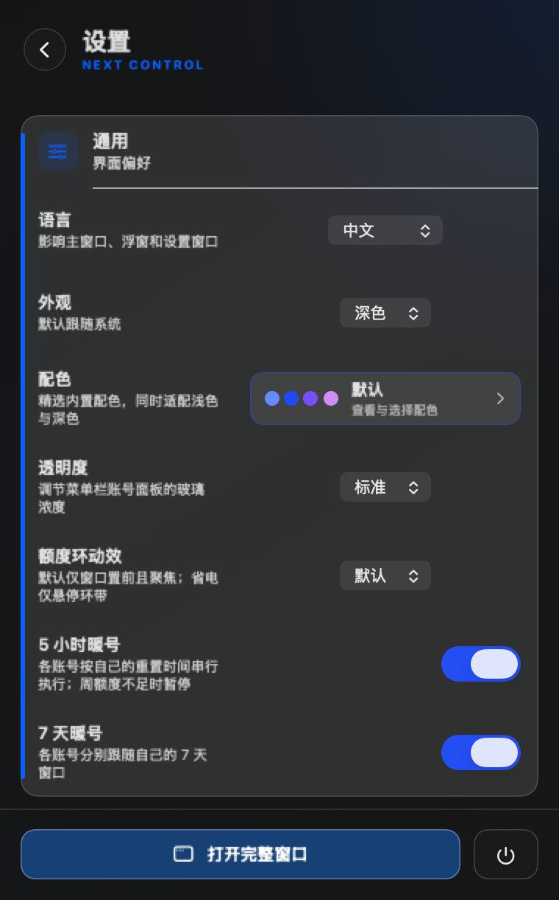

# Codex Account Manager Next 0904v1

[中文](README.md) | **English**

A local-first macOS control center for saved Codex accounts, official quota, minimal warm-up, terminal dispatch, tasks, and local usage. Low-quota automation recommends an eligible account without replacing the current Desktop identity.

> This is an unofficial project. Only an explicit **Switch Desktop** action may replace `~/.codex/auth.json`; low-quota reminders never do. Warm-up and Feishu notifications require opt-in. No third-party automation can guarantee zero account-enforcement risk.



## Recommended remote companion

To operate this Mac from a phone, tablet, or another computer, install NetEase UU Remote from its [official download page](https://uuyc.163.com/download/). UU Remote handles screen control, while Next stays local and continues to manage accounts, quota, warm-up, and account-pool CLI work without becoming a remote-control service.

On macOS, the official Homebrew Cask is also available through `brew install --cask uuremote`; see [`Homebrew/homebrew-cask`](https://github.com/Homebrew/homebrew-cask/blob/main/Casks/u/uuremote.rb). The formula is maintained by the Homebrew community and is not a NetEase source repository. As of 2026-09-02, the NetEase product site does not link an official open-source GitHub repository; GitHub `uu-remote` topics and similarly named projects should not be treated as official NetEase releases.

## Low-quota recommendations

A recommendation is produced only when every guard passes:

- The official 5-hour window has `<= 5%` remaining, or the 7-day window has `< 10%` remaining.
- The live task connection is online and at most 45 seconds old, with no running or waiting-for-input realtime task.
- Codex has been out of the foreground for at least two minutes, and the legacy account manager is not running.
- Each candidate is verified in realtime through its own `CODEX_HOME`, and has at least `30%` remaining in every triggering window.
- The account participates in dispatch, has sufficient fresh quota, is idle in Hub, and the reminder cooldown has elapsed.

The result is a verified terminal-account recommendation. It does not quit Codex, rewrite `~/.codex`, or switch Desktop. Manual Desktop switching remains a separate explicit action guarded by identity binding, a cross-process lock, a `0600` recovery journal, atomic credential write, verification, and ownership-aware rollback.

## Feishu notifications

- The webhook is stored only in macOS Keychain. It is never prefilled into UI, project state, or logs.
- Only `https://open.feishu.cn/open-apis/bot/v2/hook/...` and `https://open.larksuite.com/open-apis/bot/v2/hook/...` are accepted. Redirects are rejected.
- Cards contain only a masked account label, triggering window, remaining quota, recommendation, and timestamp.
- Notification failure does not alter local account or quota state. A test card is sent only after an explicit user click.

## Preserved features

- Saved-account cards, login/re-login, ordering, notes, deletion, and explicit Switch Desktop.
- Official Codex app-server identity, 5-hour/7-day/monthly quota, reset credits, and expiry data.
- Menu-bar quota rings, main window, status density, optional global shortcut, light/dark palettes, and accessibility basics.
- Today tasks, automations, session opening, and local Codex token, cost, trend, project, and Skill statistics.
- Local inference performance and AI leadership views; CC Switch remains read-only.
- Per-account Refresh, Warm Up, Use in Terminal, and dispatch controls are independent. Refresh never sends a warm-up request.
- Warm-up uses `gpt-5.6-luna`, low reasoning, a read-only sandbox, an ephemeral run, and a one-character reply. Failures require a manual retry.
- All saved-account quota is refreshed every 10 minutes while warm-up is enabled and every 30 minutes while it is disabled; both maintenance paths are quota-only.
- Accounts excluded from dispatch still keep the 7-day and official unexpected-reset warm-up behavior.
- Existing macOS release tooling and the Windows Tauri workspace remain in the repository.

## Isolation from the legacy app

- Bundle ID: `com.blackielf.codex-account-manager-next`
- Executable: `CodexAccountManagerNext`
- Saved profiles: `~/.codex-account-manager-next/profiles/`
- App data: `~/Library/Application Support/CodexAccountManagerNext/`
- Cache: `~/Library/Caches/CodexAccountManagerNext/`
- The global shortcut is disabled by default to avoid registration conflicts.

The development copy neither overwrites nor starts the legacy app. A manual Desktop switch changes Codex's shared active login. Next repeats legacy-process checks, compares the current credential immediately before writing, and serializes its own switches; the legacy app does not share that lock, so zero race across both versions is not guaranteed.

## Build and pure local checks

Requires macOS 13+, Codex CLI, and Xcode Command Line Tools. Building does not install or launch the app:

```bash
make build
build/CodexAccountManagerNext.app/Contents/MacOS/CodexAccountManagerNext --self-test-automatic-account-switch
build/CodexAccountManagerNext.app/Contents/MacOS/CodexAccountManagerNext --self-test-account-switch-safety
build/CodexAccountManagerNext.app/Contents/MacOS/CodexAccountManagerNext --self-test-feishu-webhook
build/CodexAccountManagerNext.app/Contents/MacOS/CodexAccountManagerNext --self-test-account-automation-audit
```

`make run`, `make probe`, a real account switch, and a real Feishu send access local or external state and must be invoked explicitly in a trusted environment.

## Version and provenance

- Release: `0904v1`
- Bundle version: `9.4.1 (11)`
- Since `0902v1`: account cards can choose a model, reasoning effort, and Standard/Fast speed; terminal launch and Hub dispatch reuse the same CLI parameters, with a one-time Apply to All action.
- Since `0831v9`: the main window no longer exposes the multi-agent remote console; local account-pool CLI, quota inspection, and Hub dispatch remain available. The documentation now recommends NetEase UU Remote as an optional companion and distinguishes official downloads from third-party GitHub projects.
- Since `0831v8`: an existing state file that cannot be decoded safely is now read-only and cannot be overwritten by fallback state; credential identity backfill preserves reset-credit fields; a low-quota trigger emits only the recommendation notification instead of a duplicate automatic-switch failure.
- Since `0831v7`: the 10/30-minute all-account quota maintenance timer is no longer reset by the main view's 3/5-minute refresh cycle.
- Since `0831v6`: the main window appears on first launch, failed warm-up no longer retries automatically, and quota maintenance continues every 30 minutes when warm-up is disabled.
- Baseline implementation notes: [docs/0826v1-IMPLEMENTATION.md](docs/0826v1-IMPLEMENTATION.md)
- Direct baseline: the current working tree of Codex Account Manager 0818v1
- Upstream: a SwiftUI project derived from [codexU](https://github.com/shanggqm/codexU)
- Reference research: [docs/REFERENCE_IMPLEMENTATIONS.md](docs/REFERENCE_IMPLEMENTATIONS.md)
- License: [MIT](LICENSE)
