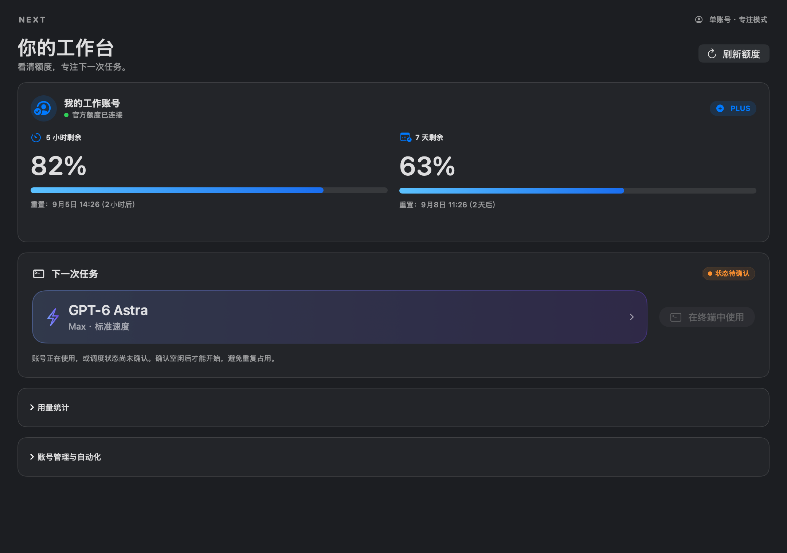
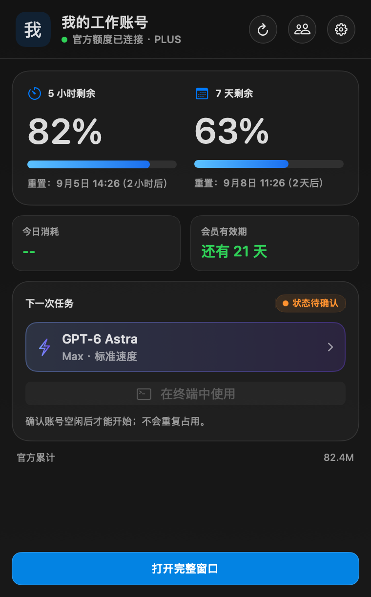
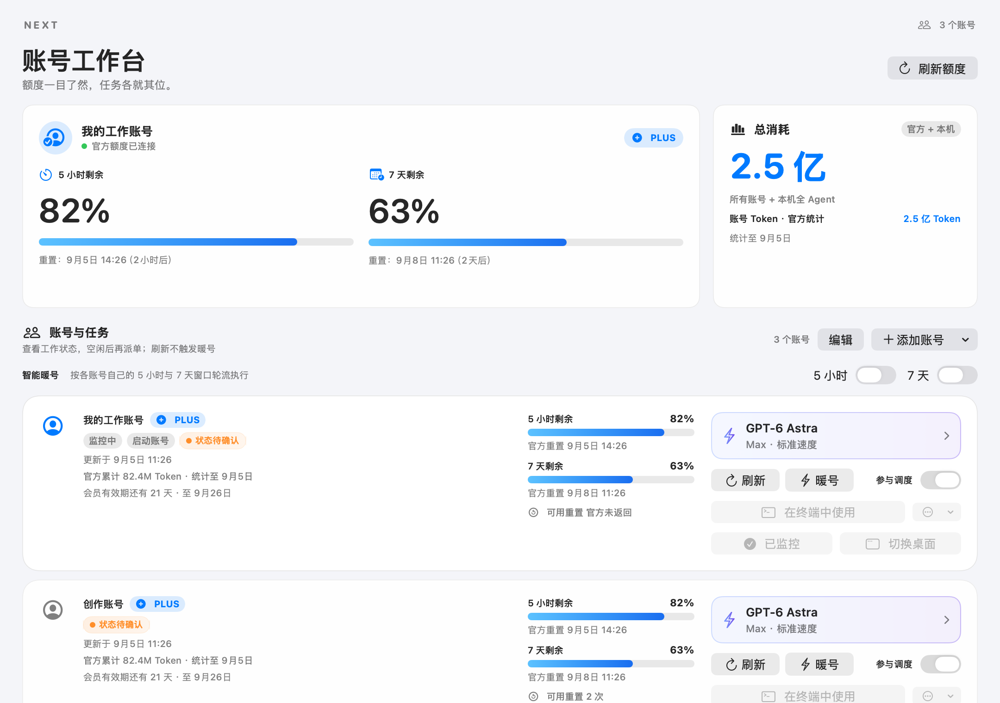

# Codex Account Manager Next

**中文** | [English](README.en.md)

[](https://github.com/BLACKIELF/codex-account-manager-next/actions/workflows/ci.yml)


[](LICENSE)

面向 macOS 的本地优先 Codex 工作台。一个账号也能清楚查看额度、选择任务模型；多个账号可以集中管理隔离环境、监控任务占用。支持 GPT-6 Astra，模型、思考强度和 Standard/Fast 速度会一起传给后续 CLI。

当前版本：`0905v1` · `9.5.1 (13)`。项目非 OpenAI 官方产品，不提供账号、不增加额度，也不绕过登录、MFA 或平台限制。



> 0905v1 图片由实际生产 SwiftUI 组件以 2× 渲染，工作台为 2160 × 1520 px。账号、额度、订阅日期均为演示数据，截图过程不连接 Hub、不读取真实凭据或 Keychain；“状态待确认”是未连接的真实界面表现。下文保留的 0904v2 局部截图对应未改动功能。

## 0905v1 更新重点

- 新增 `gpt-6-astra`，支持 CLI 的六档思考强度与 Standard/Fast，已有账号设置不被替换。
- 蓝紫色模型卡、原生分档滑杆、模型菜单、Fast 开关与恢复默认；多个独立账号时可“应用到所有账号”。
- 自动识别单账号：主窗口和菜单栏优先呈现两段额度、任务模型与终端入口。统计、暖号、登录和高级设置可展开访问。
- 重排多账号工作台、提高浅色／深色对比度，账号卡支持窄窗口排版；去掉重复的独立巡检页，将快照异常合并到账号卡。
- 补齐 Astra 参数、持久化、批量应用、计价及单账号去重回归测试；统一纯测试入口和 Swift 格式检查。
- 保留 Hub 占用保护、暖号协议、提醒、安全切换与账号隔离，不降低未知状态下的保护门槛。

历史变更见 [CHANGELOG.md](CHANGELOG.md)。

只有一个账号，还是同时管理多个账号？欢迎参与[下一版优化讨论](docs/feedback/0905v1-discussion.md)，告诉我们最希望省掉哪一步。这里也有可单独使用的 [0905v1 推文](docs/announcements/0905v1-social-post.md)。

## 功能地图

| 区域 | 当前可用能力 |
|---|---|
| 工作台 | 当前监控账号、5 小时/7 天额度、重置时间、官方累计 Token、本机全 Agent Token 与费用估算 |
| 账号卡 | 刷新、暖号、参与调度、执行偏好、独立 CLI、监控、重新登录、Chrome 会话、显式 Desktop 切换 |
| 就地状态提示 | Hub 任务状态、快照过期、刷新失败、低额度颜色与参与调度开关 |
| 自动化中心 | 低额度账号推荐、飞书通知、安全门禁与最近审计事件 |
| 菜单栏与设置 | 额度环、密度、语言、主题、配色、快捷键、置顶、后台驻留与更新检查 |

当前完整窗口统一为工作台，不再提供重复的巡检页或页面切换导航。Windows 工作区与历史统计模型不代表 macOS 已提供对应页面。

## 一个账号也能使用



- 只有当前 Codex 登录时，直接查看额度，不要求注册第二个账号，不修改系统登录。
- 单账号同样支持自动暖号。主动启用后，Next 按账号窗口与空闲状态发送最小请求，尝试启动下一轮计时；5 小时和 7 天分别控制，不必每轮手动发消息。暖号会消耗额度，条件与时间规律见[智能暖号](#智能暖号)。
- 需要选择 Astra 等任务模型时，用“设置独立 CLI”把**同一个账号**登录到 Next 的隔离环境；这是隔离环境，不是切换当前 Desktop 身份。
- 同一身份的系统入口与独立入口不会被算成两个账号。单账号模式隐藏无意义的批量按钮，原有高级功能保留在“账号管理与自动化”。
- CLI 与暖号仍需要下面的 Hub 映射与新鲜状态；未配置 Hub 的单账号用户可以先只读监控。专注模式不会把“状态未知”伪装成“空闲”。



## 五个常用账号动作，边界完全不同

| 动作 | 做什么 | 会消耗额度 | 会改当前 Desktop 身份 | Hub 门禁 |
|---|---|---:|---:|---:|
| 刷新 | 读取官方身份、额度和重置时间 | 否 | 否 | 不要求空闲 |
| 暖号 | 用该账号发送一次最小 `hi` 请求，完成后刷新额度 | 是 | 否 | 需可信映射与新鲜概览，且无同别名活跃任务 |
| 在终端中使用 | 以该账号独立 `CODEX_HOME` 启动 Codex CLI | 任务本身会 | 否 | 需可信映射与新鲜概览，且无同别名活跃任务 |
| 重新认证 | 通过官方页面更新目标资料的本地凭据 | 否 | 仅系统账号会 | 不作为任务占用入口 |
| 切换 Desktop | 把 Codex App 当前登录切换到目标账号 | 否 | **是** | 使用独立切换安全事务 |

低额度提醒不会提供启动或切换动作：应用内只显示候选账号文字并写本地审计；启用飞书时还会发送脱敏通知。用户需要回到对应账号卡手动启动 CLI，该通用终端入口仍会独立检查 Hub 状态。

## 每账号执行偏好


每个独立账号保存一份执行偏好；修改后立即用于该账号后续启动的 CLI 及其默认子 Agent，不写入账号的 `config.toml`。

| 模型 | 推理强度 | 速度 |
|---|---|---|
| `gpt-6-astra` | Low / Medium / High / XHigh / Max / Ultra | Standard / Fast |
| `gpt-5.6-sol` | Low / Medium / High / XHigh / Max / Ultra | Standard / Fast |
| `gpt-5.6-terra` | Low / Medium / High / XHigh / Max / Ultra | Standard / Fast |
| `gpt-5.6-luna` | Low / Medium / High / XHigh / Max | Standard / Fast |
| `gpt-5.5` | Low / Medium / High / XHigh | Standard / Fast |
| `gpt-5.2` | Low / Medium / High / XHigh | Standard |

默认值为 `gpt-5.6-sol + high + Standard`。不兼容组合会被阻止，不会覆盖上一份有效设置。“应用到所有账号”只做一次批量覆盖，之后仍可逐个账号调整。

Astra 的 CLI 参数以本机模型目录为准；账号是否已开放模型由服务端决定，不做静默降级。`最高` 对应 `max`，`Ultra` 是单独一档。CLI 提供的 Ultra 与公开 API 的 reasoning 参数范围不应混用。Astra 本地 API 等效估算采用其独立价格，不再落到旧模型参考价；该数字不等于订阅账单。参见 [OpenAI Astra 模型文档](https://developers.openai.com/api/docs/models/gpt-6-astra)。

参数传播包括主模型、主推理强度、默认子 Agent 模型、默认子 Agent 推理强度，以及 Standard/Fast 服务等级。Hub 若从其他入口创建任务，必须显式复用这条生成命令或同一组参数；Next 当前只读取 Hub 状态，不替 Hub 创建任务。暖号是独立维护动作，固定使用轻量的 `gpt-5.6-luna`，不复用任务执行偏好。

## Hub 任务状态与重复占用风险控制

Next 从本机 `http://127.0.0.1:8787/api/overview` 读取 Hub 概览，以账号调度别名关联任务：

- 每 10 秒刷新一次。
- 概览超过 30 秒即视为不新鲜。
- 运行态包括：待批准、准备中、工作进行中、正在请求取消、状态待确认。
- 成功、失败或取消会在账号卡上保留约 2 分钟，然后恢复“未运行”。
- Hub 离线、返回未知状态、账号别名缺失或快照过期时，Next 采用 fail-closed：终端入口禁用；暖号执行时由同一门禁拒绝。
- 新鲜概览中没有该可信别名的活跃任务，或只有已结束状态时，入口才重新开放。

这是一层账号占用协调与状态反馈，不是应用内远程任务控制台，也不是原子租约。检查与真正启动之间仍存在竞态，因此所有外部派单器也必须遵守同一 Hub 占用协议。Next 不会接管中枢身份、不会替 Hub 创建任务，也不会在后台偷偷切换当前 Codex 账号。

### Hub 集成前置配置

当前 Hub 联动是由外部中枢预配置的集成，应用内还没有映射编辑器。公开源码不会自动发现账号别名，也不会自行创建这些配置。外部派单器若使用模型白名单，也必须加入 `gpt-6-astra` 与六档强度；只更新 Next 不会自动部署另一套 Hub 服务。

账号卡的调度编号与 Hub 别名在应用启动前写入：

```text
~/Library/Application Support/CodexAccountManagerNext/dispatch-codes-v1.json
```

```json
{
  "schemaVersion": 1,
  "accounts": [
    {
      "code": "A",
      "alias": "account-a",
      "profileId": "<managed-profile-id>"
    }
  ]
}
```

`code` 必须是唯一的单个 `A`–`Z` 字母，`alias` 与 `profileId` 不能为空。该文件在进程启动时读取一次，修改后需要重启 Next。

独立巡检页已移除，`inspection-config-v1.json` / `CAMNEXT_INSPECTION_CONFIG` 不再由 Next 使用；已有本地配置文件不会被删除。账号卡继续依赖 `dispatch-codes-v1.json` 与新鲜 Hub 概览进行占用保护。

## 多账号与浏览器登录

- 每个独立管理账号使用 Next 保存的隔离 `CODEX_HOME` 与凭据快照；系统账号仍代表当前用户的 `~/.codex`。
- 第一次添加或重新认证时，可绑定现有 Chrome Profile，或使用账号专属、长期复用的 Chrome 会话。
- 官方登录、密码、Cookie 和 MFA 仍由官方页面处理；Next 不读取也不绕过它们。
- 添加后校验稳定 Account ID 与脱敏邮箱，阻止重复账号和身份不一致。
- 支持备注、排序、选择监控账号，以及把本地账号资料移到废纸篓；删除本地资料不会删除 OpenAI 账号。
- Pro `5x/20x` 是显示标记，不改变真实套餐或额度。
- 本地 Reset 历史可手动校正，但不会冒充官方可用 Reset 次数。

## 状态直接显示在账号卡

不再需要切换到单独的巡检页：主工作台集中显示官方额度、任务占用、最近结果和刷新状态。快照超过 30 分钟、时间异常或刷新失败会就地提示；低额度继续使用颜色表达，参与调度开关仍在原处。

旧巡检中固定对比 `gpt-5.6-sol + high` 的配置基线已移除，避免把用户主动选择的 Astra 等模型当成异常。提示不触发登录、配置改写、暖号或账号切换。

## 智能暖号


5 小时与 7 天暖号分别开关，默认关闭，必须主动启用。

### 五小时窗口与自动暖号的关系

5 小时是额度统计窗口，不是保证能连续运行 5 小时。官方说明用量还取决于模型、任务复杂度与上下文，本地和云端共用额度，也可能同时受周限额约束。实际限制和重置时间应查询官方用量面板或 CLI 的 `/status`。[OpenAI 官方用量说明](https://learn.chatgpt.com/docs/pricing#what-are-the-usage-limits-for-my-plan)

Next 读取官方 `windowDurationMins` 与 `resetsAt`。前者是窗口分钟数，后者是下一次重置的 Unix 秒时间戳。距离重置的秒数按 `max(0, resetsAt - 当前时间)` 计算，不从打开 Next、刷新或用光额度的时刻重新计时。[OpenAI 官方字段说明](https://learn.chatgpt.com/docs/app-server#6-rate-limits-chatgpt)

举个有条件的例子。如果早上 9 点的有效请求触发新窗口，官方返回下午 2 点重置，那么 11 点正式开工时离重置还有 3 小时；Next 不会把它自行改成下午 4 点。暖号的目的，是在旧窗口结束后自动发出一次最小请求，尝试启动下一窗口，减少忘记手动发请求的空档。

公开文档没有承诺所有套餐、所有时刻都严格按“第一条消息加 5 小时”起算。因此这个例子是帮助理解暖号策略，不是官方固定规则或保证。`resetsAt - 窗口时长` 只能反推窗口起点，不能证明哪条请求触发了它。Next 发送请求后仍要重新读取官方状态；满额度、请求成功或本机倒计时归零，都不能单独证明新窗口已经启动。5 小时重置也不代表 7 天限制同时解除。

单账号和多账号都能启用这项功能。当前实现要求 Next 持续运行、电脑保持唤醒并联网，且账号身份、额度、Hub 映射和空闲状态检查通过。5 小时自动暖号通常只作用于开启“参与调度”的账号，检测到意外重置时有单独处理；7 天开关独立生效。它不会唤醒关机或睡眠的电脑，不会增加额度，也不会调用官方重置券。工作时段限制和每日维护请求上限仍是讨论方向，尚未实现。

### 执行与保护

执行流程：

1. 先做纯额度刷新，确认身份与新鲜额度。
2. 要求正式调度别名，并确认新鲜 Hub 概览中没有同别名活跃任务。
3. 使用临时、无 Cookie、无缓存的网络会话调用 ChatGPT Codex 后端 SSE 地址。
4. 发送 `gpt-5.6-luna`、`store:false`、最小 `hi` 请求。
5. 成功后再次读取额度；失败则分类记录，不在同一空闲窗口自动重试。

实现包含 45 秒请求超时、90 秒资源超时、64 KiB 响应上限、1 MiB auth 文件读取上限，并拒绝重定向。登录失效、403、429、服务端异常、网络、超时、响应过大和 SSE 不完整会分别显示。

暖号期间会阻止添加账号，以及登录、删除、切换和并发手动刷新。启用暖号时全账号每 10 分钟纯刷新；全部关闭时仍每 30 分钟纯刷新。7 天剩余额度不高于 5% 时会暂停 5 小时自动暖号。

协议实现参考 [qxcnm/Codex-Manager](https://github.com/qxcnm/Codex-Manager)，按 MIT 许可保留说明，详见 [THIRD_PARTY_NOTICES.txt](Resources/THIRD_PARTY_NOTICES.txt)。

## 低额度账号推荐


> 截图仅展示手动开启后的控件状态；全新安装默认关闭。

该功能默认关闭，是基于本机已保存数据的候选提示，不是自动派单或自动切号。当前推荐条件为：

- 源账号官方 5 小时剩余 `<= 5%`，或 7 天剩余 `< 10%`。
- 源额度与本机 Codex 任务快照均在 45 秒内，没有运行中、等待输入或无法确认的任务。
- Codex 已离开前台至少 2 分钟，旧版账号管理器未运行。
- 源账号与候选账号均开启“参与调度”。
- 候选账号有已保存的邮箱、Account ID 与本地 `auth.json`，且已保存快照在每个触发窗口均至少剩余 30%。
- 距离上一次评估至少 1 小时。

推荐阶段不会重新验证候选账号身份或快照新鲜度，也不会检查候选账号的 Hub 空闲态，因此不提供启动或切换动作。应用内显示推荐文字并写入本地审计；启用且配置飞书后会额外发送脱敏通知。用户需要回到候选账号卡手动点击“在终端中使用”，由该入口执行 Hub 门禁。推荐本身不会改写 `~/.codex/auth.json`，不会切换 Desktop。

## 飞书通知

飞书只使用群聊“自定义机器人”Webhook：

- Webhook 仅保存在 macOS Keychain，不回填到界面，不写设置、日志或仓库。
- 只接受 `open.feishu.cn` 与 `open.larksuite.com` 的官方 HTTPS Bot Hook 路径，禁止重定向。
- 卡片包含脱敏源/候选账号与非敏感事件元数据，例如事件标题、结果、窗口、剩余额度、时间和随机事件 UUID；不包含凭据或任务正文。
- 发送失败不会改变本机账号或额度状态。
- 保存合法 Webhook 后，即使自动通知开关关闭，用户明确点击“发送测试”仍会产生一次外部请求。
- 自动化中心只保存有界的最近审计事件，不保存 Prompt/Response 正文。

不要把 Webhook 发给 AI、粘贴到终端、Issue、截图或提交记录。

## 安全 Desktop 切换

会修改当前电脑 Codex 登录的显式路径包括 UI/`--switch-profile-id` Desktop 切换、系统账号重新认证，以及未完成切换的恢复。低额度推荐、暖号和独立账号 CLI 不会修改当前 Desktop 身份。Desktop 切换统一经过：

1. 验证目标账号邮箱与稳定 Account ID。
2. 获取 Next 专属跨进程锁并检查旧版管理器。
3. 保存源身份与私有 pending journal。
4. 先请求 Codex 优雅退出；超时后可能强制终止 App 或残留共享运行时，仍无法停止则在写入前中止。
5. 写入前再次确认源凭据没有被其他进程改变。
6. 以限制性权限原子替换 `~/.codex/auth.json`。
7. 写后验证目标身份；失败时按所有权安全回滚。
8. 重新打开 Codex；常规路径检查会话关联。用户确认的强制切换会明确跳过原任务会话恢复。

旧版账号管理器不共享 Next 的切换锁，因此两个管理器不应同时切换账号，无法承诺跨应用绝对零竞争。

## 个性化设置


- 菜单栏主要页面与设置页支持中文 / English；完整工作台、模型偏好编辑器和自动化中心目前仍以中文显示。
- 跟随系统、浅色、深色。
- 默认、青花瓷、故宫红、千里江山、敦煌飞天、兰曙、液态键帽等内置配色及明暗变体。
- 菜单栏 Minimal / Classic / Rich 三种样式，可选已用/剩余、5h、7d、月度、今日 Token 和重置倒计时。
- 可调账号弹窗密度、动画/省电模式、窗口置顶、关闭后后台驻留与全局快捷键。
- 尊重 macOS 低电量、热状态和“减少动态效果”。
- 自动检查公开 GitHub Release 每日最多一次，用户可手动随时检查；不会静默下载或安装更新。

## 系统要求与平台范围

| 项目 | 要求 / 状态 |
|---|---|
| macOS | 13.0 或更高 |
| 架构 | Apple Silicon、Intel |
| Codex | 已安装并能正常登录的 Codex App 或 CLI |
| 构建工具 | Xcode Command Line Tools、Swift、Git、Make |
| Hub 状态协同 | 外部预配置账号映射，且本机 Hub 在 `127.0.0.1:8787` 提供新鲜 overview；否则 CLI/暖号 fail-closed |
| Windows | 仓库保留 Tauri 工作区，但不承诺与当前 macOS 账号管理、切换、暖号和飞书功能等价 |

## 安装

当前仓库未发布经过 Apple Developer ID 签名与公证的 `9.4.2` GitHub Release 安装包。最可靠的安装方式是从源码在目标 Mac 本机构建；不要把 Actions 产物当成已公证发行版。

```bash
xcode-select --install
git clone https://github.com/BLACKIELF/codex-account-manager-next.git
cd codex-account-manager-next
make build
```

构建不会自动启动或安装 App。产物位于：

```text
build/CodexAccountManagerNext.app
```

首次安装到当前用户目录：

```bash
mkdir -p "$HOME/Applications"
ditto build/CodexAccountManagerNext.app "$HOME/Applications/CodexAccountManagerNext.app"
open "$HOME/Applications/CodexAccountManagerNext.app"
```

如果已有 Next，请先退出正在运行的同一个 App，确认没有重复安装，再备份并覆盖该路径。不要把 Next 安装成第二个同名副本，也不要覆盖名称不同的旧版管理器。

本地源码构建使用 ad-hoc 签名，不等于 Apple 公证。可检查完整性：

```bash
codesign --verify --deep --strict build/CodexAccountManagerNext.app
```

## 首次配置

1. 先让官方 Codex 正常登录一个账号。
2. 打开 Next，点击“添加账号”。
3. 选择账号专属 Chrome，或绑定已有 Chrome Profile，完成官方登录。
4. 等待身份与额度验证，通过后设置备注；若本机中枢已配置调度映射，界面会显示对应编号。
5. 为账号选择模型、推理强度与 Standard/Fast；需要统一时再点“应用到所有账号”。
6. 确认 Hub 在线且账号显示“未运行”，再使用“在终端中使用”。
7. 只有确实需要改变 Codex App 当前登录时，才点击“切换 Desktop”。
8. 智能暖号、低额度提醒与飞书均按需主动开启。

## 更新与卸载

更新源码：

```bash
git pull --ff-only
make build
```

退出已安装的 Next，保留需要的恢复备份，再用新构建覆盖原安装路径。升级不会自动打开暖号、低额度提醒、飞书或 Desktop 切换。

卸载 App 时，将 `CodexAccountManagerNext.app` 移到废纸篓即可。只有在确认不再需要已保存账号、设置和 Keychain 项后，才另行删除 Next 的独立数据；删除 App 本身不会删除这些资料。

## Next 与旧版完全隔离

| 项目 | Next 命名空间 |
|---|---|
| Bundle ID | `com.blackielf.codex-account-manager-next` |
| 可执行文件 | `CodexAccountManagerNext` |
| 保存账号 | `~/.codex-account-manager-next/profiles/` |
| Application Support | `~/Library/Application Support/CodexAccountManagerNext/` |
| 缓存 | `~/Library/Caches/CodexAccountManagerNext/` |

Bundle、可执行文件、Profiles、Application Support、Cache、Defaults、快捷键、更新、日志和临时文件均使用 Next 独立命名空间。两者唯一共享的关键对象是 Codex 当前登录使用的 `~/.codex/auth.json`；显式 Desktop 切换、系统账号重新认证和未完成切换恢复可能按验证事务写入它。

## 隐私与网络边界

- 不把 Token、Webhook、原始账号邮箱或 Prompt/Response 正文写入应用界面、默认日志、测试夹具、文档截图或提交。诊断 JSON 与统计界面会隐藏已知的项目/Skill 完整路径；用户明确复制/启动 CLI 时，命令使用 `$HOME` 表达独立 `CODEX_HOME`，但用户主动选择的工作目录仍必须传给自己的 shell。
- 本地统计与会话缓存可能保留项目、Skill 与 rollout 的源路径用于归并，不会由应用上传。若要提交诊断资料，请不要附带本地缓存，并继续删除日志中的私有路径。
- 状态文件存在但无法安全解码时进入只读阻断，不用空白数据覆盖。
- 官方身份与额度可由本机 Codex CLI / `codex app-server` 读取；按账号刷新时也会使用该账号本地 access token 直接请求官方 `chatgpt.com/backend-api/wham/profiles/me`。
- 暖号会先读取本机 Hub，并在请求前通过本机 `codex app-server` 刷新额度；请求成功后再刷新一次。其中直接对外的最小请求只发往 ChatGPT Codex 后端地址。
- 更新器只读取本仓库公开 GitHub Release 信息。
- 自动飞书通知要求已保存合法 Webhook 并启用开关；手动“发送测试”只要求已保存 Webhook，并会在点击后立即产生外部请求。
- 本机 Hub 只通过 loopback 地址读取状态。
- 项目不承诺零封禁、零限流或第三方服务永久兼容。

更多说明见 [SECURITY.md](SECURITY.md)。

## 常见问题

### “在终端中使用”为什么是灰色？

Next 没有拿到 30 秒内的 Hub 概览、账号调度映射缺失、Hub 返回未知状态，或该账号已有任务正在执行。先按“Hub 集成前置配置”完成外部映射，再启动本机 Hub、等待下一次 10 秒轮询，并确认账号最终恢复“未运行”。

### 暖号为什么不执行？

检查开关、身份、额度快照、Hub 空闲状态和周额度。暖号失败不会在同一空闲窗口自动重试；出现新的有效额度窗口后才会重新判断。

### 为什么又要求登录 Google / OpenAI？

首次添加、官方会话失效、密码变化或安全验证都会要求重新登录。请绑定正确的 Chrome Profile 或使用账号专属 Chrome；Next 不读取密码、Cookie 或 MFA。

### 额度很低，为什么没有推荐？

触发阈值、源额度与任务快照新鲜度、前台空闲、旧版进程、参与调度、候选已保存额度与 1 小时评估间隔必须全部通过。该提示不会在推荐阶段验证候选 Hub 空闲态；真正启动 CLI 时才执行 Hub 门禁。部分前置条件不通过时会直接保持静默，只有形成推荐后才写入自动化审计。

### 飞书通知失败怎么办？

确认使用群聊自定义机器人生成的完整官方 Webhook、机器人仍在群中且允许列表匹配。重新保存后只在愿意发送真实消息时点击测试；不要把 URL 发到 Issue 或聊天里。

### 工作台为什么没有旧版“趋势/项目/Skill/领导力”页面？

0905v1 聚焦统一工作台。重复巡检页和未挂载的旧视图已清理；底层统计数据模型仍服务于现有用量与菜单栏展示，不把未提供入口的页面列为当前功能。

## 开发与验证

核心纯本地检查：

```bash
make build
make test-profile-store
make test-account-inspection
make test-automatic-account-switch
make test-account-switch-safety
make test-feishu-webhook
make test-account-automation-audit
make test-app-server-pipe
make test-token-counter
make test-macos-compatibility
build/CodexAccountManagerNext.app/Contents/MacOS/CodexAccountManagerNext --self-test-warm-up-policy
make memory-risk-check
codesign --verify --deep --strict build/CodexAccountManagerNext.app
git diff --check
```

`make run`、`make probe`、`make install`、真实登录、真实暖号、真实账号切换与真实飞书发送会接触本机或外部状态，必须在可信环境中由用户明确触发。纯测试通过也不能证明这些真实行为已经完成。

## 版本、来源与许可

- 版本名称：`0905v1`
- Marketing Version：`9.5.1`
- Build：`13`
- 基线设计：[docs/0826v1-IMPLEMENTATION.md](docs/0826v1-IMPLEMENTATION.md)
- 安全边界：[SECURITY.md](SECURITY.md)
- 完整历史：[CHANGELOG.md](CHANGELOG.md)
- 上游：基于 [codexU](https://github.com/shanggqm/codexU) 的 SwiftUI 项目
- 暖号协议参考：[qxcnm/Codex-Manager](https://github.com/qxcnm/Codex-Manager)，MIT 声明见 [THIRD_PARTY_NOTICES.txt](Resources/THIRD_PARTY_NOTICES.txt)
- 许可证：[MIT](LICENSE)

欢迎通过 [Issue](https://github.com/BLACKIELF/codex-account-manager-next/issues) 报告可复现问题。提交前请移除账号邮箱、Token、Webhook、任务正文、日志中的私有路径和截图里的个人信息。
