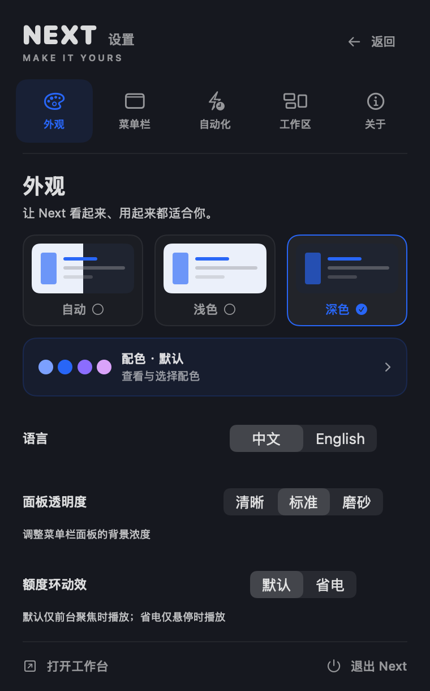
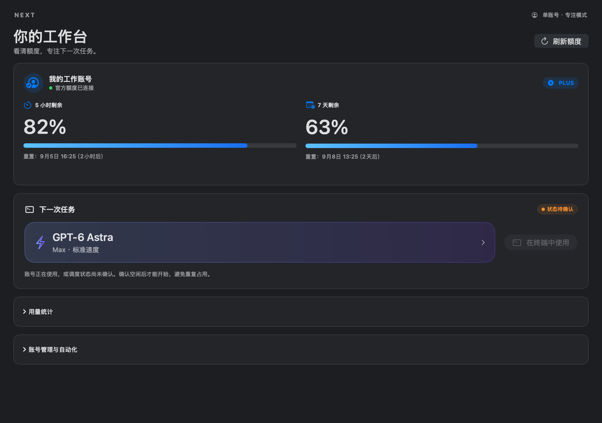
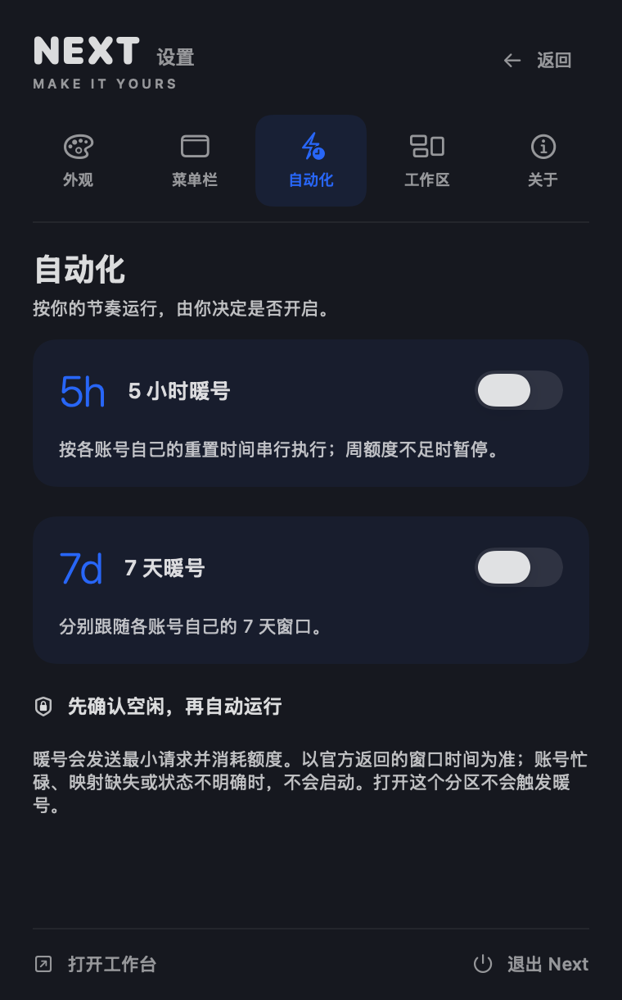
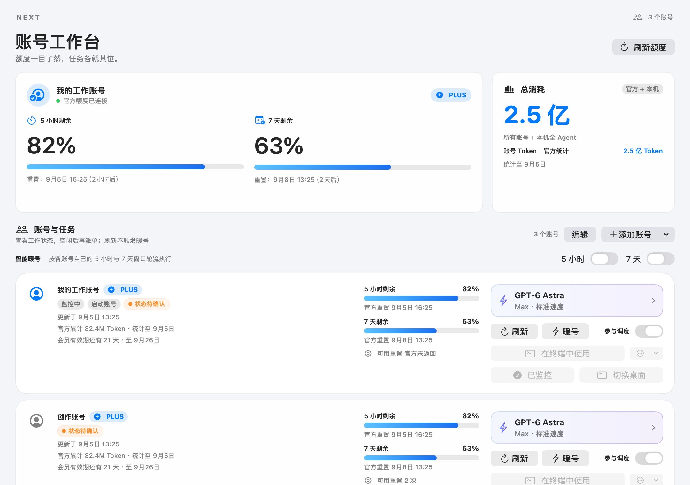
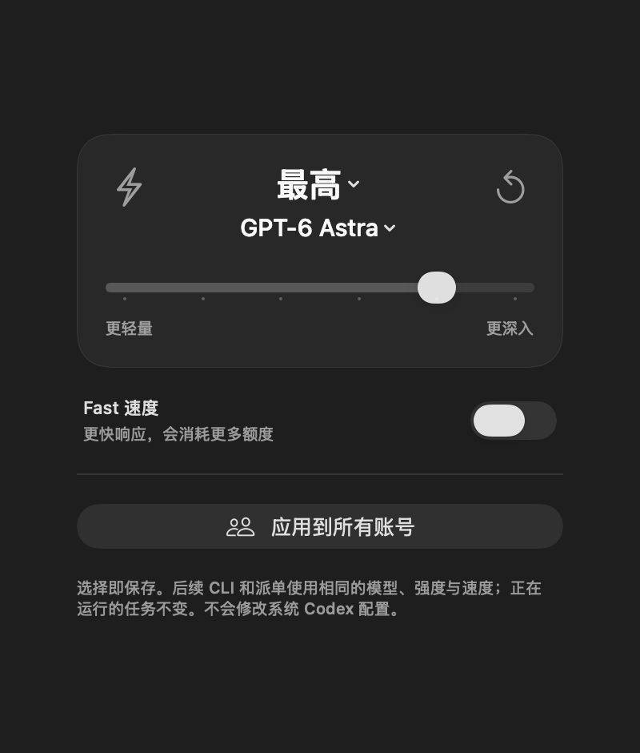

# 我把 Next 重新整理了，一个 Codex 账号也能用得上

选模型时，点开一个叫“模型”的菜单，里面还要再点一次“模型”，才能看到选项。每次只多点一下，放在经常要用的地方，就该改。

这次 Next 更新到 0905v3，我把这层多余的菜单去掉了，也重新做了设置页。外观、菜单栏、自动化、工作区、关于，五个分区直接切换。主题有预览，少量选项直接摆出来，暖号也有了自己的位置。



Next 的完整名字是 Codex Account Manager Next，是一款 macOS 本地工作台。它把 Codex 账号的额度、任务模型和占用状态放在一起。介绍它时，我想从只有一个账号的人讲起。

## 只有一个账号，先把额度看清楚

“账号管理”容易让人以为，得有好几个账号才值得安装。Next 的单账号用法其实很直接。打开主界面，或者点菜单栏，就能看官方返回的五小时、七天剩余额度和重置时间。只做查看，可以沿用当前 Codex 登录，不要求你再注册一个账号。

单账号界面把额度和任务入口放在前面，统计与高级管理需要时再展开。同一个身份的系统入口与隔离入口也会去重，不会被算成两个账号，再塞给你一组用不上的批量按钮。



如果你还想提前选好任务模型，就把同一个账号登录到 Next 管理的隔离 CLI 环境。这个过程不要求第二个账号，也不会因为启动独立 CLI 就换掉当前 Desktop 的登录。

这里仍有门槛。当前版本的 CLI 启动和暖号依赖本机 Hub 调度服务，需要配置账号映射并拿到可信状态。只想看额度，可以先停在只读用法；没有接好 Hub，界面不会把“状态未知”当成“未运行”。

## 暖号能帮忙，但先弄清五小时的含义

单账号也能开自动暖号。五小时和七天分别控制，默认都关闭。启用后，Next 在窗口结束、身份与空闲检查通过时，发送一次最小请求，尝试启动下一窗口，再读取官方额度。

五小时是额度统计窗口，不能理解为买到了五小时连续工作时间。模型、上下文和任务复杂度都会影响消耗，本地与云端使用共享套餐额度，周限额也可能同时生效。[官方用量说明](https://learn.chatgpt.com/docs/pricing)

用一个有条件的例子解释。假设早上九点发出请求后，官方显示下午两点重置。你十一点开始正式工作，距离重置就剩三小时。打开 Next 或点击刷新，不会把这个时间改成下午四点。

Next 使用官方返回的窗口长度和下一次重置时间。公开说明没有保证每个账号、每次请求都严格遵循“第一条消息加五小时”，所以实际仍看账号返回的时间。请求成功也不能单独证明新窗口已经开始。[官方窗口字段说明](https://learn.chatgpt.com/docs/app-server#6-rate-limits-chatgpt)



暖号的价值在于少一次手动发请求的操作。它会消耗额度，不能增加额度、强行提前重置或解除周限制，也不会替你兑换重置券。Next 要保持运行，Mac 要醒着并联网；电脑睡着时，它不会把电脑唤醒。

## 多个账号，重点变成谁正在工作

有多个账号时，单看剩余额度还不够。一个账号看起来余量很多，也可能正被另一个 Agent 使用。

Next 可以把各账号的额度、重置时间、备注和任务状态放在同一张工作台。接入 Hub 后，账号卡会显示待批准、工作进行中与最近结果。任务结束后，结果保留一小段时间，再恢复未运行。



已知忙碌、服务离线或状态不可信时，Next 会关闭新任务入口。不过，检查状态到启动之间仍有时间差。外部派单器也必须遵守同一占用协议，目前不能承诺所有入口都绝无重复调度。

每个独立账号还能保存自己的模型、思考强度和标准或 Fast 速度。需要统一时，一次应用到所有独立账号，之后仍可逐个调整。

GPT-6 Astra 已进入选择列表，能否调用取决于账号开放情况。后续 CLI 启动会带上所选参数，正在运行的任务不被中途改动。Fast 会更快消耗额度；维护用的暖号采用固定轻量模型，与任务模型设置分开。



低额度候选提示和飞书通知可以按需开启。它们负责告诉你发生了什么，不会自动替你换掉当前 Desktop 账号。

## 下一版，我更想先减少配置

当前版本完成了设置重做、模型菜单简化，也把单账号和多账号的入口重新排过。但对第一次安装的人来说，Hub 配置仍然偏重。

接下来值得讨论的方向有几个。单账号能否不依赖额外服务就安全启动 CLI？暖号能否限定工作时段，再给维护请求设每天的上限？多账号能否直接看清哪个 Agent 正在占用，以及这个状态有多久没有更新？

这些都还在征求意见，没有当成已上线功能。你可以留言说自己只有一个账号还是多个账号，以及最想省掉哪一步。报错截图请先去掉邮箱、凭据和任务正文。

当前安装方式是按 README 在 Mac 上从源码构建。0905v3 尚未提供公证安装包，也没有在这次更新中提供等价的 Windows 账号功能。本文配图来自真实 SwiftUI 组件的原生 2× 渲染，使用隔离演示数据，不能当作真实任务成功运行的证据。

GitHub 项目地址

[Codex Account Manager Next](https://github.com/BLACKIELF/codex-account-manager-next)

想交给 Agent 安装，可以单独复制下面这段

```text
请从 https://github.com/BLACKIELF/codex-account-manager-next 安装 Codex Account Manager Next。先阅读 README，检查系统要求与已有安装。已有 Next 就备份后原位升级，不新增副本；保留账号数据和当前 Codex 登录。完成后验证版本与启动，缺少权限、依赖或官方登录时告诉我，不绕过安全检查。
```
