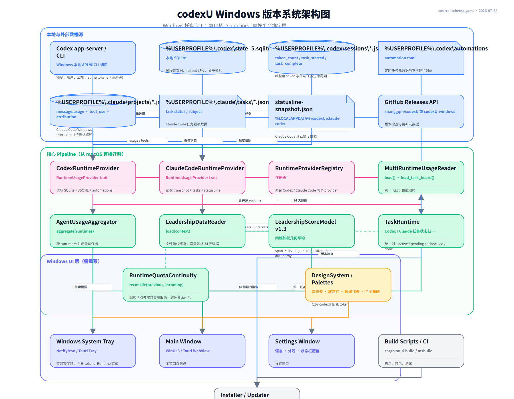

# codexU Windows Desktop Blueprint

## 架构图



架构事实与视图：

- [`schema.yaml`](./schema.yaml)：唯一语义事实源。
- [`diagram.mmd`](./diagram.mmd)：GitHub / Obsidian Mermaid fallback。
- [`diagram.svg`](./diagram.svg) 与 [`diagram.html`](./diagram.html)：确定性维护视图。
- [`diagram.render.png`](./diagram.render.png)：确定性渲染候选。
- [`diagram.generated.png`](./diagram.generated.png)：生成式展示候选。
- [`diagram.png`](./diagram.png)：完成语义与视觉复核后的选定视图。
- [`render.py`](./render.py)：项目本地确定性 renderer。

> 当前文件先固化 Windows 语义源。图像候选、几何结果与最终选图状态会在本次重做的渲染阶段更新。

## 定位与边界

codexU Windows 是本地优先的 Tauri 桌面工具：它只读本机 Codex 状态和已成功解析的官方额度，把敏感内容在 reader 边界缩减为安全观察，再通过稳定的 `CodexDashboardSnapshot` 契约交给托盘、Dashboard 与 Settings。这里描述的是当前 Windows 实现，不从 macOS 源码推导模块，也不把未来设想画成已完成架构。

## 五块运行图

| 运行块 | 责任 | 输入 | 输出 | 非目标 |
| --- | --- | --- | --- | --- |
| 1 · 本地证据与官方额度 | 定义只读输入边界 | `state_5.sqlite`、sessions、archived sessions、automations、Codex app-server quota | 本地观察与已验证官方额度窗口 | 不上传数据；缺失额度不伪造成 0 |
| 2 · 安全读取与隐私缩减 | 读取状态、transcript、Task Board 与 Skill 观察并立即缩减 | 本地原始观察 | usage/task/skill 安全摘要 | 不保留 prompt、回复、tool arguments、raw logs 或敏感路径 |
| 3 · 用量、任务与 Leadership 聚合 | 构建本地用量、任务、Leadership 1.4-real，并应用/保留官方额度 | 安全摘要、官方额度旁路 | 完整 Dashboard 数据 | 不把本地 token 估算伪装成官方额度 |
| 4 · Snapshot 与 AppState / IPC | 固定前后端契约，管理缓存、single-flight、generation 与刷新 | 聚合结果 | `CodexDashboardSnapshot`、Tauri commands/events | 不让陈旧 refresh 覆盖新来源 |
| 5 · Windows Desktop UI | 呈现 Overview、Tasks、AI Leadership、Usage、Projects、Skills、Tray 与 Settings | 已缩减 Snapshot、设置和刷新事件 | 真实 Tauri / WebView2 桌面界面 | 首屏不展示敏感正文或 raw logs |

中心图是混合拓扑而不是五步机械流水线：本地证据沿 `Evidence → Readers → Aggregation → Snapshot/AppState → UI` 前进；官方额度作为只读旁路从输入边界进入 Aggregation/Snapshot，不穿过 transcript/task readers。

## 运行时契约账本

| From | To | 契约 / 产物 | 类型 |
| --- | --- | --- | --- |
| 本地证据与官方额度 | 安全 Readers | SQLite / JSONL / automation observations | 主数据流 |
| 安全 Readers | Aggregation | safe session/task/skill observations | 主数据流 |
| 官方额度 | Aggregation | successfully parsed quota windows | 只读旁路 |
| Aggregation | Snapshot / AppState | `CodexDashboardSnapshot` | 前后端数据契约 |
| Snapshot / AppState | Windows Desktop UI | Tauri commands、events 与 refresh state | 展示契约 |

## 测试按对象挂接

测试不是第二条业务泳道。每个验证节点位于 Runtime 边界外，只连接它真正验证的对象。

| 验证或工具 | 直接对象 | 它证明什么 | 当前 Windows 证据 |
| --- | --- | --- | --- |
| Quota Protocol / Continuity Tests | 输入边界、Aggregation | app-server 协议解析、额度 apply/retain | `windows/crates/codexu-core/tests/codex_app_server_quota.rs`、`codex_dashboard_quota.rs` |
| Reader & Aggregation Rust Tests | Readers、Aggregation | SQLite/transcript/task/skill 缩减与 Leadership 聚合 | `windows/crates/codexu-core/src/readers/`、`tests/task_board.rs` |
| AppState Tests | Snapshot / AppState | cache、single-flight、generation、retry | `windows/apps/codexu-tauri/src-tauri/src/app_state.rs` |
| Web Contract Tests | Windows Desktop UI | React 层级、quota、Tasks、Skills、Leadership rail 契约 | `windows/apps/codexu-tauri/web/tests/*.test.mjs` |
| Native Screenshot Demo | Windows Desktop UI | 当前 checkout 的真实 release executable、WebView2、窗口尺寸与 exact HWND 捕获 | `windows/scripts/Capture-NativeVisuals.ps1`、`native-visual-capture/GraphicsCaptureSnapshot.cs` |
| Screenshot Workflow Preflight | Native Screenshot Demo | 截图引擎、exact HWND、六个 surface 与本地产物边界 | `windows/scripts/tests/Test-NativeVisualCaptureWorkflow.ps1` |

最关键的嵌套关系是：

```text
Screenshot Workflow Preflight
        -- verifies workflow --> Native Screenshot Demo
        -- captures exact HWND --> Windows Desktop UI
        -- produces -----------> local manifest + 12 PNGs
```

因此，Preflight 测的是截图工具；截图 Demo 才直接面对 UI。这能表达“测试也有自己的测试”，而不会把两者混成一个笼统的 UI 测试块。

## 诊断、构建与证据

- `codexu-probe` 是 Readers/Aggregation 的只读诊断消费者，不属于 UI 运行链。
- Release Build & Package 组合 Tauri backend 和 WebView UI，目标为 MSI/NSIS，并向截图 Demo 提供精确 release executable。
- Native Screenshot Demo 的 manifest、日志与两种 client size 下的 12 张 PNG 只写入 `.local-artifacts/windows-visual-captures/`。这些文件包含真实本地证据，保持 Git ignored，不进入 Blueprint、报告或公开提交。

## 证据能证明什么

- Rust 测试证明对应 reader、聚合或 AppState 行为，不证明窗口渲染质量。
- Web contract tests 证明 React/CSS 源码契约，不证明真实 WebView2、DPI、窗口装饰、原生对话框或 IPC。
- Native Screenshot Demo 证明当前 checkout、当前构建和当前本地数据下的可见表面；它不是视觉回归基线，也不自动等于完整 UI 质量通过。
- 最终 Blueprint 只记录本次实际运行的 schema、几何和图像复核结果，不追溯宣称旧运行记录仍然有效。

## 已排除的旧设想

新 schema 不保留旧 Blueprint 中的 Claude 主路径、`RuntimeProviderRegistry`、`MultiRuntimeUsageReader`、旧 Leadership v1.3、WinUI/Tauri 二选一、GitHub updater 或未落地发布节点。它们不是当前 Windows Desktop Runtime 的事实。

## 当前验证状态

- 语义源：待本次 `validate_blueprint.py` 复核。
- 确定性图：待从新 schema 生成并运行 geometry gate。
- 生成式候选：待从同一语义与 composition 生成并复核忠实度。
- 最终 `diagram.png`：待比较两个候选后选择。
