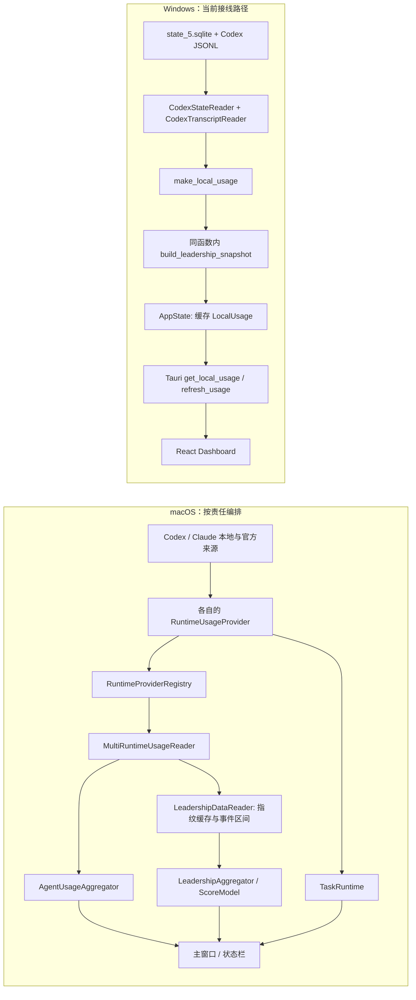

# macOS / Windows 架构对齐审查

日期：2026-07-28
范围：只读代码与现有架构文档审查；未改动产品实现，也未把本报告当作运行时或视觉验收。

## 结论

**当前 Windows 版本应被视为 Codex-first 的局部重建，而不是 macOS 架构的等价实现。Claude Code 暂不在 Windows 范围内；本审查不要求补做它。**

macOS 的关键不是 SwiftUI 外观，而是先以 runtime snapshot 保留输入边界，再进行编排、聚合、任务归一和领导力证据评分。Windows 当前可以只做 Codex，但它的运行链路仍绕过了这些边界：从 Codex 状态库和 JSONL 读取后，直接产出一个 `LocalUsage`，同时在同一个聚合函数中生成领导力分数，再把该单一对象经 Tauri 交给 React。

这解释了“照着 macOS 做却不对”的根因：复制了展示名、面板和部分 Rust 类型，却没有复用 macOS 的**数据契约与责任分界**。现有 [Windows 蓝图](../blueprint/schema.yaml) 仍把未接入的 provider、registry、multi-reader、quota continuity 和 runtime tray 画成现状，因此不能继续被视为 Windows 实现的真值。

这不否定 [WINDOWS_UI_PARITY_REPORT.md](WINDOWS_UI_PARITY_REPORT.md) 的有限结论：该报告只接受页面级层次，明确不主张数值或像素级 parity；本审查指出的是它无法证明架构或语义 parity。

## 两条真实数据流



Windows 的 `ClaudeCodeTranscriptReader` 和 `RuntimeScope` / `MultiRuntimeUsageSnapshot` 类型虽存在，但当前 Tauri `AppState` 没有调用或返回它们。按当前范围，这不是缺陷：Claude reader 应保持未启用，不能在报告或产品中暗示 Windows 已支持 Claude。

## macOS：真正清晰的块是什么

| 架构块 | 责任与输出 | 代码证据 |
|---|---|---|
| Runtime 边界 | 以 `RuntimeUsageProvider` 输出 `RuntimeUsageSnapshot`；Codex 与 Claude Code 可以分别失败、分别表达来源与状态。 | [RuntimeProvider.swift](../../../Sources/CodexUsageWidget/Providers/RuntimeProvider.swift#L29) |
| 编排与聚合 | `MultiRuntimeUsageReader` 先得到每个 runtime 的快照，再交给 `AgentUsageAggregator`；领导力读取是并列分支，不藏在 usage 合计中。 | [MultiRuntimeUsageReader.swift](../../../Sources/CodexUsageWidget/Services/MultiRuntimeUsageReader.swift#L15), [AgentUsageAggregator.swift](../../../Sources/CodexUsageWidget/Services/AgentUsageAggregator.swift#L3) |
| 领导力证据链 | 读取 rollout / transcript，按文件指纹缓存成 worker 与 interval，再交给 `LeadershipAggregator`。 | [LeadershipDataReader.swift](../../../Sources/CodexUsageWidget/Services/LeadershipDataReader.swift#L12), [LeadershipModel.swift](../../../Sources/CodexUsageWidget/Domain/LeadershipModel.swift#L304) |
| 可信度门槛 | `estimated` 不得评分；总分需要足够证据覆盖和活跃天数，无法满足时分数是 `nil`。 | [LeadershipModel.swift](../../../Sources/CodexUsageWidget/Domain/LeadershipModel.swift#L9), [LeadershipModel.swift](../../../Sources/CodexUsageWidget/Domain/LeadershipModel.swift#L246) |
| 交互与状态栏 | `UsageStore` 保存多 runtime 快照与当前选择；状态栏渲染选中的 runtime 摘要，而不是只提供“打开窗口”。 | [main.swift](../../../Sources/CodexUsageWidget/main.swift#L626), [main.swift](../../../Sources/CodexUsageWidget/main.swift#L11427) |

macOS 当然也并非所有代码都已天然可移植：`main.swift` 仍是一个很大的 Cocoa / SwiftUI 组合根。但它的**可移植设计单位**已经存在于 Provider、Snapshot、Aggregator、Leadership evidence/model 与 UI consumer 的边界中；不应把 SwiftUI 视图本身当成移植蓝本。

## Windows：实际偏离点

| 优先级 | 发现 | 证据 | 后果 |
|---|---|---|---|
| P0 | Tauri 应用只装配 Codex reader，读取 `state_5.sqlite` 后调用 `CodexTranscriptReader`，缓存并返回 `LocalUsage`。 | [app_state.rs](../../../windows/apps/codexu-tauri/src-tauri/src/app_state.rs#L10), [app_state.rs](../../../windows/apps/codexu-tauri/src-tauri/src/app_state.rs#L136) | Codex-only 是当前允许范围；问题是顶层合同仍丢失了 runtime 可用性、来源标签、配额与 task-board 等 Codex 自身语义。 |
| P0 | IPC 只暴露 `get_local_usage` / `refresh_usage`，两者返回 `Option<LocalUsage>`。 | [usage.rs](../../../windows/apps/codexu-tauri/src-tauri/src/commands/usage.rs#L3) | React 无法表达 macOS 的 per-runtime snapshot、aggregate、quota 或 task-board 合同。 |
| P0 | `make_local_usage` 同时生成用量、项目、工具、趋势和 leadership snapshot。 | [common.rs](../../../windows/crates/codexu-core/src/readers/common.rs#L106), [common.rs](../../../windows/crates/codexu-core/src/readers/common.rs#L238) | Reader、聚合器和评分器坍缩为一个函数；即使只做 Codex，也难以独立测试、校准或说明语义。 |
| P0 | Windows 领导力由 token events、tool-call 比率和固定启发式值推导，且无论证据是否达到 macOS 门槛都会返回 `Some(score)`。 | [common.rs](../../../windows/crates/codexu-core/src/readers/common.rs#L391), [common.rs](../../../windows/crates/codexu-core/src/readers/common.rs#L507) | 这不是 macOS v1.3 的等价模型：macOS 从 worker interval / evidence quality 得出可为空的分数。相同 badge 或标题不能被解释为相同含义。 |
| P1 | Rust 已定义 `RuntimeScope`、`RuntimeUsageSnapshot` 与 `MultiRuntimeUsageSnapshot`，但它们没有被当前应用路径使用。 | [runtime.rs](../../../windows/crates/codexu-core/src/models/runtime.rs#L6), [app_state.rs](../../../windows/apps/codexu-tauri/src-tauri/src/app_state.rs#L160) | 即使只启用 Codex，也应先把单 runtime snapshot 接入；不要因未来多 runtime 类型存在就误称已经对齐。 |
| P1 | Claude reader 已实现，却只在 CLI 中被使用，未被 Tauri `AppState` 调用。 | [claude_transcript.rs](../../../windows/crates/codexu-core/src/readers/claude_transcript.rs#L79), [codexu-cli/main.rs](../../../windows/crates/codexu-cli/src/main.rs#L146) | 这是有意的未启用能力，不在当前交付范围；必须避免把它表述为 Windows app 功能。 |
| P1 | Dashboard 明确标注 `Local only`，Tasks 与 Skills 也诚实地显示当前 snapshot 不提供数据。 | [Dashboard.tsx](../../../windows/apps/codexu-tauri/web/src/windows/Dashboard.tsx#L118), [DashboardHome.tsx](../../../windows/apps/codexu-tauri/web/src/components/DashboardHome.tsx#L248) | 这些是正确的降级文案，但也证明当前 UI 面板不能代表 macOS 功能语义。 |
| P2 | Windows tray 只有 Open / Settings / Refresh / Quit；没有以 selected runtime 生成的扫描摘要。 | [tray.rs](../../../windows/apps/codexu-tauri/src-tauri/src/tray.rs#L7) | 系统托盘目前是窗口入口，不是 macOS `NSStatusItem` 的等价 consumer。 |

当前工作树中 `Dashboard.tsx` 的顶层 tab 缩减是用户进行中的 UI 改动；本审查不将其归为架构缺陷，也没有改动它。

## 应作为新真值的 Windows 目标边界

不建议“继续翻译 macOS 代码”，也不建议推倒重写 Tauri。应让 Windows 重回与 macOS 相同的**责任顺序**，实现语言和系统外壳可以不同。

```text
Windows Codex local sources / app-server
  -> Codex platform adapter (唯一启用的 provider)
  -> RuntimeUsageSnapshot boundary
       -> local usage / task normalization / quota continuity
       -> leadership evidence reader/cache -> macOS-aligned scoring semantics
  -> CodexDashboardSnapshot IPC contract
  -> Tauri state cache + React dashboard / tray consumers
```

当前阶段，IPC 应升级为一个明确的 `CodexDashboardSnapshot`，其中含一个完整的 `RuntimeUsageSnapshot`；不必为了未来的 Claude 先实现真正的多 runtime 聚合。至少应携带：

- `codex`：Codex 的原始 snapshot、可用性、来源标签和 task board；
- `aggregate`：当前可以省略；只有第二个已启用 runtime 出现时才引入“全部 runtime”视图；
- `leadership`：独立 evidence pipeline 的结果，证据不足时 `score` / `title` 为 `null`；
- 刷新时间与可解释的降级原因；
- 当前范围不需要 runtime 选择器；将来引入第二个 provider 时，再把选择 / 可见范围放在 UI 偏好层，而不是数据读取器中。

`LocalUsage` 仍应保留，但只应是一个 runtime 的本地使用量子对象，不能再承担整个 Windows app 的顶层响应。

## 重建顺序

1. **冻结并更正架构声明。** 把 Windows 蓝图标为“目标草案”，不要继续说“从 macOS 直接迁移”；本报告的两条数据流可作为改图前的审查基线。
2. **先补 Codex seam，不做新面板。** 在 `codexu-core` 接线 Codex provider，让它返回 `RuntimeUsageSnapshot`；不接入 Claude reader，也不展示 Claude 状态。
3. **把领导力从 usage 聚合中拆出。** 移植 worker / interval / evidence quality / coverage gate 的语义，或在完成前把 Windows 结果明确标为“估算”，不可复用 macOS 的权威等级文案。
4. **再替换 Tauri IPC 与状态缓存。** `AppState` 缓存 Codex dashboard snapshot；React 只消费已解释的合同，不直接把缺失数据渲染成数值或同义 feature。
5. **最后才收敛 UI 与 tray。** 每一个页面、空态和 tray 摘要先绑定真实合同；视觉对齐与原生截图验收放在数据语义验证之后。

## 本次验证与边界

- 已检查 macOS 的 Provider、MultiRuntime、聚合、领导力模型、`UsageStore` 和状态栏消费者。
- 已检查 Windows core reader、Tauri state / IPC / tray、React hook 与 Dashboard 的实际调用链。
- 已核对 Windows 蓝图与当前代码；它描述的是目标结构，非当前运行结构。
- 未运行 build、probe、Tauri app 或新的原生截图；本报告不声称运行时、性能或视觉验收通过。
- 未改动任何产品代码；生成本报告时保留了既有的 `Dashboard.tsx` 与截图改动。

## 后续决策

若接受本结论，下一项工作不应是继续调页面，而是先建立一套只覆盖 Codex 的、可由 macOS 和 Windows 共同验证的脱敏 JSON fixture 与契约测试。这样后续每移植一个 Codex 数据边界或评分维度，都能判断是在实现 parity，还是只是在复制 UI。
