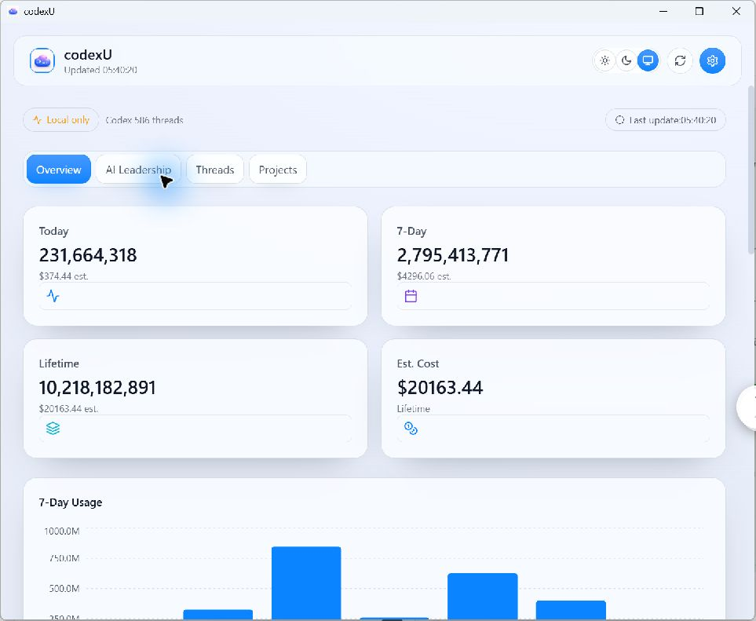
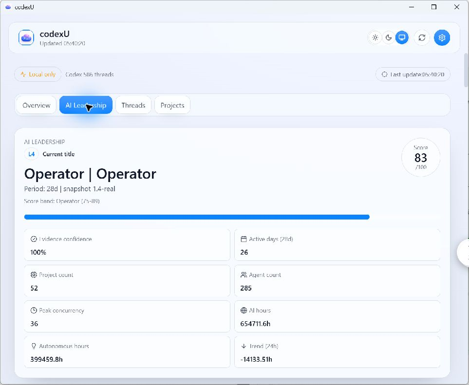
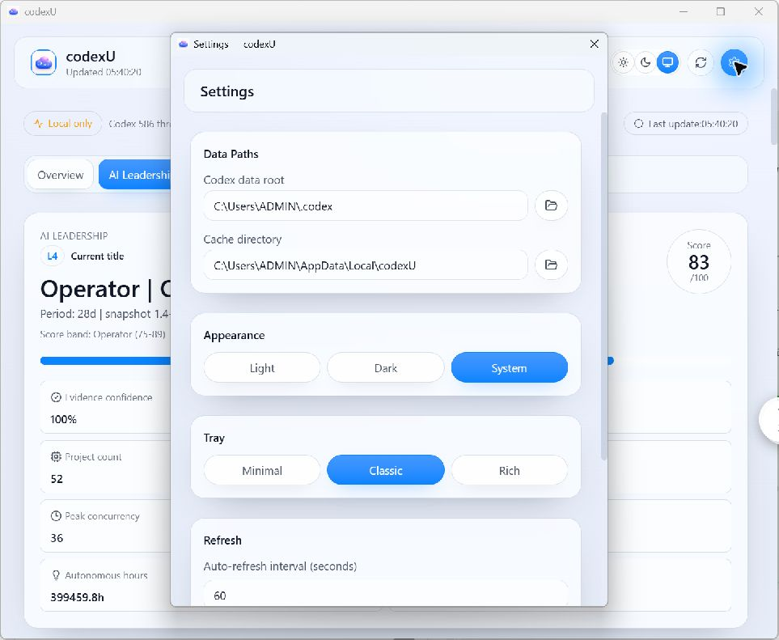
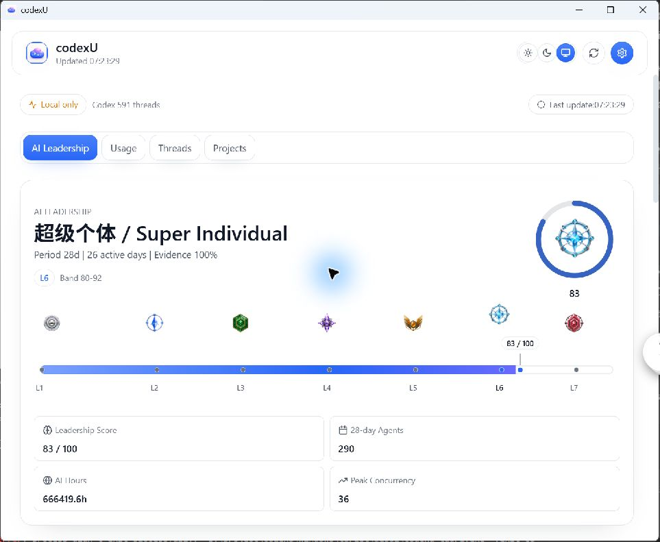
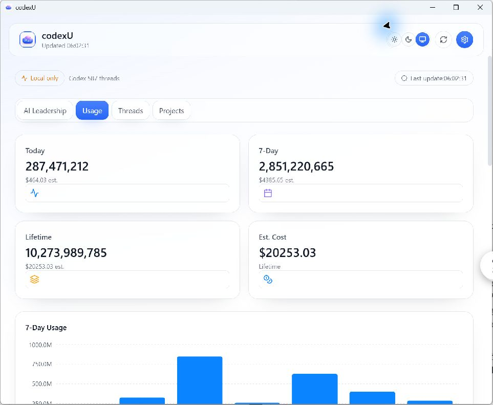

# Windows UI Parity Report: Dashboard Leadership and Theme Parity

- Report date: 2026-07-26
- Scope: Windows Tauri UI parity for AI Leadership default hero, leadership level mapping, metric layout semantics, settings panel integrity, theme centralization, and dark-mode regression fix.
- Files modified:
  - `windows/apps/codexu-tauri/web/src/utils/appTheme.ts`
  - `windows/apps/codexu-tauri/web/src/index.css`
  - `windows/apps/codexu-tauri/web/src/utils/leadershipTitles.ts`
  - `windows/apps/codexu-tauri/web/src/components/LeadershipPanel.tsx`
  - `windows/apps/codexu-tauri/web/src/main.tsx`
  - `windows/apps/codexu-tauri/web/src/windows/Dashboard.tsx`
  - `windows/apps/codexu-tauri/web/src/windows/Settings.tsx`
  - `docs/windows-port/reports/WINDOWS_UI_PARITY_REPORT.md`
  - `docs/windows-port/reports/WINDOWS_UI_PARITY_REPORT.html`

## Mac authoritative mapping (Leadership levels)

| Band | canonical id | Score range | 中文 | English | Badge file |
| --- | --- | --- | --- | --- | --- |
| L1 | `l1` | 0–19 | 碳基牛马 | Carbon Laborer | `Resources/LeadershipBadges/leadership-badge-l1.png` |
| L2 | `l2` | 20–34 | 赛博监工 | Cyber Overseer | `Resources/LeadershipBadges/leadership-badge-l2.png` |
| L3 | `l3` | 35–49 | 分身队长 | Clone Captain | `Resources/LeadershipBadges/leadership-badge-l3.png` |
| L4 | `l4` | 50–64 | 硅基领主 | Silicon Lord | `Resources/LeadershipBadges/leadership-badge-l4.png` |
| L5 | `l5` | 65–79 | 硅基统帅 | Silicon Marshal | `Resources/LeadershipBadges/leadership-badge-l5.png` |
| L6 | `l6` | 80–92 | 超级个体 | Super Individual | `Resources/LeadershipBadges/leadership-badge-l6.png` |
| L7 | `l7` | 93–100 | 人类最强者 | Humanity's Apex | `Resources/LeadershipBadges/leadership-badge-l7.png` |

- Source references: `Sources/CodexUsageWidget/Domain/LeadershipModel.swift` and `Sources/CodexUsageWidget/UI/LeadershipViews.swift`.

## Resource/token ownership table

| Token class | Owned by |
| --- | --- |
| Palette-owned accent | `Resources/Palettes/codexu.default` (`accent.primary`, `accent.primaryStrong`, `accent.secondary`, `accent.secondaryStrong`, `accent.highlight`) |
| Palette-owned quota | `Resources/Palettes/codexu.default` (`quota.primary`, `quota.secondary`) |
| Palette-owned data | `Resources/Palettes/codexu.default` (`data.*`) |
| Palette-owned selection | `Resources/Palettes/codexu.default` (`selection.*`) |
| Palette-owned ornament | `Resources/Palettes/codexu.default` (`ornament.*`) |
| App theme-owned surface | `windows/apps/codexu-tauri/web/src/utils/appTheme.ts` (`--surface*`) |
| App theme-owned text | `windows/apps/codexu-tauri/web/src/utils/appTheme.ts` (`--text-*`) |
| App theme-owned status | `windows/apps/codexu-tauri/web/src/utils/appTheme.ts` (`--status-*`) |
| Palette color facts | `accent.primary: #2866F7`, `accent.primaryStrong: #1F59ED`, `accent.secondary: #8B6DFF`; `data.tokenInput: #0A84FF`, `data.tokenCached: #8B6DFF`, `data.tokenOutput: #FF9F0A` |

## Screenshot evidence gallery

- Windows artifacts (all files collected):
  - `docs/windows-port/reports/assets/baseline-dashboard.png` — Baseline Dashboard in legacy Overview/Usage view before this UI iteration.
  - `docs/windows-port/reports/assets/baseline-leadership.png` — Baseline Leadership panel before canonical L1–L7 and real badge adoption.
  - `docs/windows-port/reports/assets/baseline-settings.png` — Baseline Settings before the UI iteration.
  - `docs/windows-port/reports/assets/final-leadership-command-rail.png` — Final native release capture, real 963×791 screenshot of final command rail (`leadership`), including visible badge art, score/title line, `L1–L7` markers, and compact marker at runtime.
  - `docs/windows-port/reports/assets/final-usage.png` — Final Usage dashboard showing `Usage` (renamed from `Overview`) plus 2×2 key metrics and retained Usage/Threads/Projects structure.
  - `docs/windows-port/reports/assets/final-settings.png` — Final Settings panel without clipping.

- Mac promo references:
  - `../../screenshot-v1.2.0-ai-leadership.png`
  - `../../screenshot-v1.1.0-palette-gallery.png`

## Comparison matrix

| Axis | Baseline | Final |
| --- | --- | --- |
| Architecture | Leadership rendering used a rank row and orbit flow but not all levels, thresholds, and badge linkage were represented as a continuous command rail in native UI. | Final architecture uses a continuous command rail with real `l1`–`l7` resources at canonical thresholds `0/20/35/50/65/80/93`, score/title row, and compact 83/100 marker context. |
| Rank/gradient behavior | L1/L7 semantics existed, but native score-to-fill behavior and clipping at score boundary were not fully verified in final capture. | Semantic gradient spans 0–100 and is physically clipped at `score`; marker and fill now align with band boundaries and current score semantics. |
| Primary color | Palette and app tokens were mixed without explicit ownership boundaries for all surfaces/text. | Palette remains canonical for accent/quota/data/selection/ornament; app layer owns `--surface`, `--text`, and `--status` semantics. |
| Layout density | 2×2 metric grid was not finalized against the latest hero state. | Final Leadership hero keeps 2×2 metric matrix with score/title block and command rail context. |
| Navigation/consistency | `Usage/Threads/Projects` was present but visual intent vs mac hierarchy was mixed with theme assumptions. | Windows keeps white tool surface and nav structure intentionally; mac shots are retained only as hierarchy reference, not as dark marketing-theme pixel target. |
| Validation depth | No native final native screenshot for this exact command-rail state. | Final native release screenshot now exists as definitive state evidence (final-leadership-command-rail.png). |
| Readability | Prior behavior showed reduced dark readability until theme split was stabilized. | Light/Dark/System behavior is stable after theme token fix and release smoke launch. |

## 已对齐

- AI Leadership now renders a continuous command rail with canonical `L1`–`L7` badge/threshold mapping at `0/20/35/50/65/80/93`.
- Semantic score presentation includes score/title row and compact marker context (`83/100` in captured state) with natural clipped fill from a full 0–100 gradient.
- L1–L7 badge assets are visible natively in the acceptance screenshot; no image placeholder issue remains.
- 2×2 Leadership metric matrix is preserved in hero layout.
- `Usage`, `Threads`, `Projects` navigation remains retained and `Overview` is labeled as `Usage`.
- Theme token split between palette/app ownership is consistent and dark-mode readability regression is resolved.
- Settings clipping issue is removed.

## 保留的 Windows 平台差异

- Windows keeps white tool surface and native white navigation while still matching mac hierarchy semantics.
- Mac screenshots (`screenshot-v1.2.0-ai-leadership.png`, `screenshot-v1.1.0-palette-gallery.png`) are used as semantic references only; they are not copied as pixel targets.
- No pixel diff run was completed in this acceptance pass.
- No-signal/no-data native state artifact is still missing.

## 已知缺口与下一步

- no-signal/live-state native screenshot for empty-data state was not collected in this run.
- No manual pixel-diff versus mac captures was executed.
- Next step: capture no-signal/no-data native screenshots for Leadership and Settings in a fresh acceptance environment.

## Validation

| Command | cwd | Exit | Raw output tail |
| --- | --- | --- | --- |
| `npm run build` | `windows/apps/codexu-tauri/web` | 0 | `✓ built in 3.15s` |
| `cargo test --workspace` | `windows` | 0 | `running 9 tests`, `test result: ok. 9 passed` |
| `cargo tauri build --no-bundle` (attempt 1) | `windows/apps/codexu-tauri/src-tauri` | 1 | `error: failed to remove file ... codexu-tauri.exe (os error 5)` |
| `cargo tauri build --no-bundle` (retry) | `windows/apps/codexu-tauri/src-tauri` | 0 | `Finished 'release' profile ... Built application at: E:\project\codexU\windows\target\release\codexu-tauri.exe` |
| `git diff --check` | repo root | 0 | `No whitespace errors detected (warning: LF→CRLF conversion note only).` |
| `windows/target/release/codexu-tauri.exe` release smoke launch | repo root | 0 | `process_count=1`, `window_count=1` at captured 963×791 native target for `final-leadership-command-rail.png`. |

## Conclusion / Alignment

- Alignment target: Leadership/default dashboard behavior, badge/level semantics, and theme ownership are functionally aligned for this release stage.
- Remaining gap is process scope: no pixel-diff comparison and no no-signal native artifact in this pass.

## Files touched summary

- `windows/apps/codexu-tauri/web/src/utils/appTheme.ts`
- `windows/apps/codexu-tauri/web/src/index.css`
- `windows/apps/codexu-tauri/web/src/utils/leadershipTitles.ts`
- `windows/apps/codexu-tauri/web/src/components/LeadershipPanel.tsx`
- `windows/apps/codexu-tauri/web/src/main.tsx`
- `windows/apps/codexu-tauri/web/src/windows/Dashboard.tsx`
- `windows/apps/codexu-tauri/web/src/windows/Settings.tsx`
- `docs/windows-port/reports/WINDOWS_UI_PARITY_REPORT.md`
- `docs/windows-port/reports/WINDOWS_UI_PARITY_REPORT.html`

## Suggested commit message

`feat(windows-ui): add Leadership command rail`
