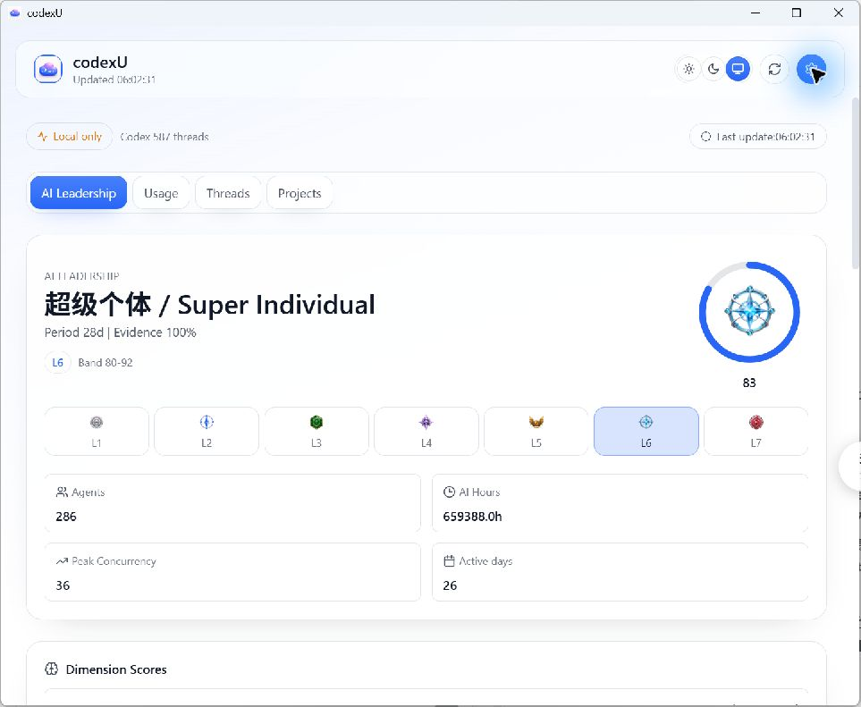

# Windows UI Parity Report: Dashboard Leadership and Theme Parity

- Report date: 2026-07-26
- Scope: Windows Tauri UI parity for AI Leadership default hero, leadership level mapping, metric layout semantics, settings panel integrity, theme centralization, and dark-mode regression fix.
- Files modified:
  - `windows/apps/codexu-tauri/web/src/utils/appTheme.ts`
  - `windows/apps/codexu-tauri/web/src/index.css`
  - `windows/apps/codexu-tauri/web/src/utils/leadershipTitles.ts`
  - `windows/apps/codexu-tauri/web/src/components/LeadershipPanel.tsx`
  - `windows/apps/codexu-tauri/web/src/main.tsx`
  - `windows/apps/codexu-tauri/web/src/windows/Dashboard.tsx`
  - `windows/apps/codexu-tauri/web/src/windows/Settings.tsx`
  - `docs/windows-port/reports/WINDOWS_UI_PARITY_REPORT.md`
  - `docs/windows-port/reports/WINDOWS_UI_PARITY_REPORT.html`

## Mac authoritative mapping (Leadership levels)

| Band | canonical id | Score range | 中文 | English | Badge file |
| --- | --- | --- | --- | --- | --- |
| L1 | `l1` | 0–19 | 碳基牛马 | Carbon Laborer | `Resources/LeadershipBadges/leadership-badge-l1.png` |
| L2 | `l2` | 20–34 | 赛博监工 | Cyber Overseer | `Resources/LeadershipBadges/leadership-badge-l2.png` |
| L3 | `l3` | 35–49 | 分身队长 | Clone Captain | `Resources/LeadershipBadges/leadership-badge-l3.png` |
| L4 | `l4` | 50–64 | 硅基领主 | Silicon Lord | `Resources/LeadershipBadges/leadership-badge-l4.png` |
| L5 | `l5` | 65–79 | 硅基统帅 | Silicon Marshal | `Resources/LeadershipBadges/leadership-badge-l5.png` |
| L6 | `l6` | 80–92 | 超级个体 | Super Individual | `Resources/LeadershipBadges/leadership-badge-l6.png` |
| L7 | `l7` | 93–100 | 人类最强者 | Humanity's Apex | `Resources/LeadershipBadges/leadership-badge-l7.png` |

- Source references: `Sources/CodexUsageWidget/Domain/LeadershipModel.swift` and `Sources/CodexUsageWidget/UI/LeadershipViews.swift`.

## Resource/token ownership table

| Token class | Owned by |
| --- | --- |
| Palette-owned accent | `Resources/Palettes/codexu.default` (`accent.primary`, `accent.primaryStrong`, `accent.secondary`, `accent.secondaryStrong`, `accent.highlight`) |
| Palette-owned quota | `Resources/Palettes/codexu.default` (`quota.primary`, `quota.secondary`) |
| Palette-owned data | `Resources/Palettes/codexu.default` (`data.*`) |
| Palette-owned selection | `Resources/Palettes/codexu.default` (`selection.*`) |
| Palette-owned ornament | `Resources/Palettes/codexu.default` (`ornament.*`) |
| App theme-owned surface | `windows/apps/codexu-tauri/web/src/utils/appTheme.ts` (`--surface*`) |
| App theme-owned text | `windows/apps/codexu-tauri/web/src/utils/appTheme.ts` (`--text-*`) |
| App theme-owned status | `windows/apps/codexu-tauri/web/src/utils/appTheme.ts` (`--status-*`) |
| Palette color facts | `accent.primary: #2866F7`, `accent.primaryStrong: #1F59ED`, `accent.secondary: #8B6DFF`; `data.tokenInput: #0A84FF`, `data.tokenCached: #8B6DFF`, `data.tokenOutput: #FF9F0A` |

## Screenshot evidence gallery

- Windows artifacts (all files collected):
  - `docs/windows-port/reports/assets/baseline-dashboard.png` — Baseline Dashboard in legacy Overview/Usage view before this UI iteration.
  - `docs/windows-port/reports/assets/baseline-leadership.png` — Baseline Leadership panel before canonical L1–L7 and real badge adoption.
  - `docs/windows-port/reports/assets/baseline-settings.png` — Baseline Settings before the UI iteration.
  - `docs/windows-port/reports/assets/final-leadership.png` — Final Leadership hero with canonical mac L1–L7 + real badge assets, 78px hero badge, L1→L7 rank track, and score rendered outside orbit ring.
  - `docs/windows-port/reports/assets/final-usage.png` — Final Usage dashboard showing `Usage` (renamed from `Overview`) plus 2×2 key metrics and retained Usage/Threads/Projects structure.
  - `docs/windows-port/reports/assets/final-settings.png` — Final Settings panel without clipping.

- Mac promo references:
  - `../../screenshot-v1.2.0-ai-leadership.png`
  - `../../screenshot-v1.1.0-palette-gallery.png`

## Comparison matrix

| Axis | Baseline | Final |
| --- | --- | --- |
| Hierarchy | Legacy Windows implementation used an `Operator`-style hero and real badge assets were not fully aligned to mac canonical mapping. | Leadership default hero now follows mac baseline semantics: canonical L1–L7, no fake/placeholder operator treatment, and canonical badge mapping. |
| Rank recognition | Orbit and badge state were present but not fully aligned to mac label-to-badge semantics. | L1→L7 rank track renders with canonical title/badge behavior and 78px hero badge; score shown outside the ring. |
| Primary color | Core accent/data tokens were still shared, but no full theme token separation for surfaces/text/status. | Palette remains source for accent/quota/data/selection/ornament; dark-mode regression fixed via theme centralization with app-owned `--surface`, `--text`, and `--status` tokens. |
| Chart density | Dashboard/leadership metrics and 2×2 card density were not consistently validated against the new hero state. | Final UI keeps the intended 2×2 key metrics on leadership/usage flow and remains visually consistent with usage thread/project structure. |
| Material/readability | Dark mode showed insufficient readability on white-like surfaces. | Main agent re-run under release confirmed Light, Dark, System themes are responsive; dark readability is normal after fix. |
| Navigation | `Usage/Threads/Projects` and settings path were present but not validated together with final hero/state changes. | `Usage`, `Threads`, `Projects` remain retained, and `Overview` label is renamed to `Usage` in final state. |
| Whitespace | Not formally measured with final hero iteration in baseline snapshot. | No layout overhaul was introduced; spacing and panel alignment are preserved in this scope. |
| Focus | Focus ring style came from palette and was not in scope in baseline review. | Focus state is unchanged because it remains palette-owned. |

## 已对齐

- AI Leadership hero now uses mac-aligned canonical text/badge semantics.
- 78px hero badge, L1–L7 rank track, and score below orbit are present.
- `Usage` is retained as a section with 2×2 key metrics and coexists with `Threads`, `Projects`.
- Theme tokenization is centralized with dark-mode material and text regression fixed.
- Settings panel visual clipping issue removed in final acceptance screenshots.

## 保留的 Windows 平台差异

- Windows keeps `Resources/Palettes/codexu.default` for all palette-owned fields and badge resources.
- Windows does not reproduce macOS dark promotional screenshot artifact style; behavior is validated by release run and captured acceptance artifacts.
- No pixel-diff pipeline was executed in this pass.

## 已知缺口与下一步

- no-signal/live-state screenshot for runtime empty-data state was not collected in this run.
- No manual pixel-diff vs mac captures was executed.
- Next step: capture no-signal/no-data state artifacts for both Hero and Settings when a fresh acceptance environment is available.

## Validation

| Command | cwd | Exit | Raw output tail |
| --- | --- | --- | --- |
| `npm run build` | `windows/apps/codexu-tauri/web` | 0 | `✓ built in 3.18s` |
| `cargo test --workspace` | `windows` | 0 | `running 9 tests`, `test result: ok. 9 passed` |
| `cargo tauri build --no-bundle` (attempt 1) | `windows/apps/codexu-tauri/src-tauri` | 1 | `failed to remove file ... codexu-tauri.exe (os error 5)` |
| `cargo tauri build --no-bundle` (retry) | `windows/apps/codexu-tauri/src-tauri` | 0 | `Finished 'release' profile ... Built application at: E:\project\codexU\windows\target\release\codexu-tauri.exe` |
| `git diff --check` | repo root | 0 | `No whitespace errors detected (warning: LF→CRLF conversion note only).` |
| `windows/target/release/codexu-tauri.exe` manual smoke | repo root | 0 | `started_process_id=45220`, `window_count=1`, process closed successfully. |

## Conclusion / Alignment

- Alignment target: Leadership/default dashboard behavior and theme baseline across light/dark/system, plus acceptance-level dark-mode regression fix, are functionally aligned with the mac reference intent as implemented in this release iteration.
- Known non-claim: no assertion of pixel-perfect parity.

## Files touched summary

- `windows/apps/codexu-tauri/web/src/utils/appTheme.ts`
- `windows/apps/codexu-tauri/web/src/index.css`
- `windows/apps/codexu-tauri/web/src/utils/leadershipTitles.ts`
- `windows/apps/codexu-tauri/web/src/components/LeadershipPanel.tsx`
- `windows/apps/codexu-tauri/web/src/main.tsx`
- `windows/apps/codexu-tauri/web/src/windows/Dashboard.tsx`
- `windows/apps/codexu-tauri/web/src/windows/Settings.tsx`
- `docs/windows-port/reports/WINDOWS_UI_PARITY_REPORT.md`
- `docs/windows-port/reports/WINDOWS_UI_PARITY_REPORT.html`

## Suggested commit message

`feat(windows-ui): align AI Leadership visual hierarchy`

