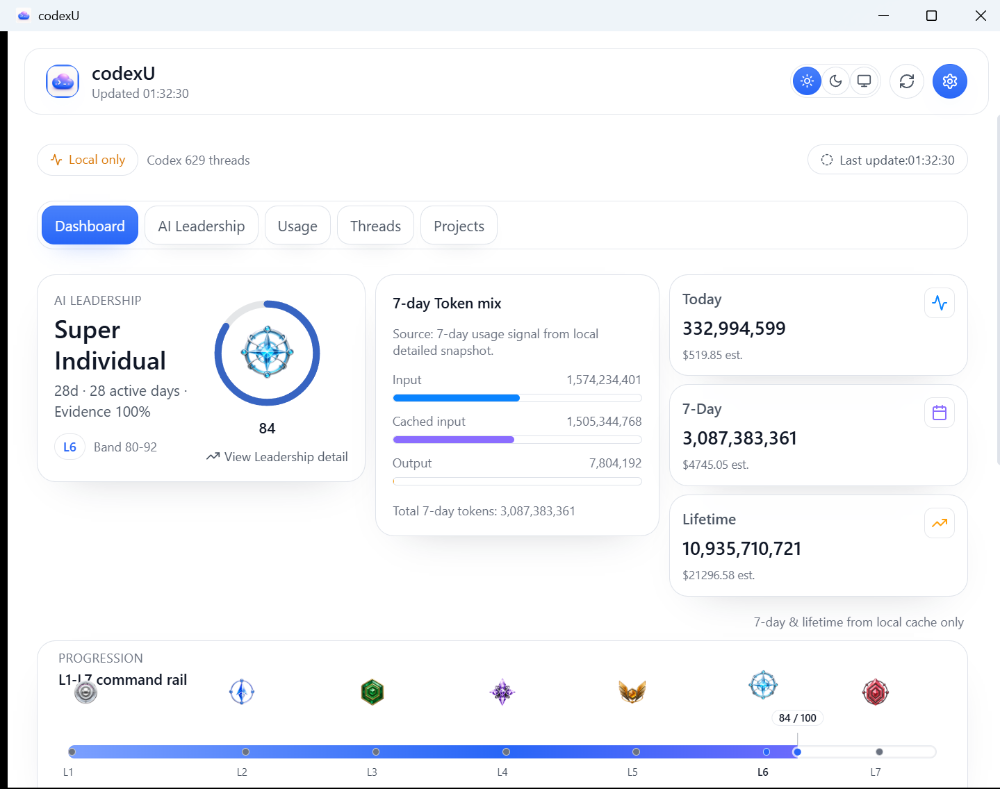
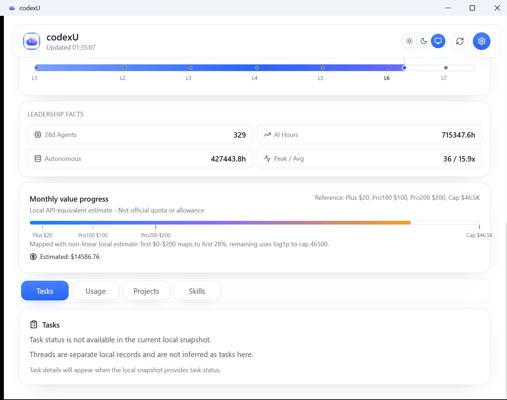
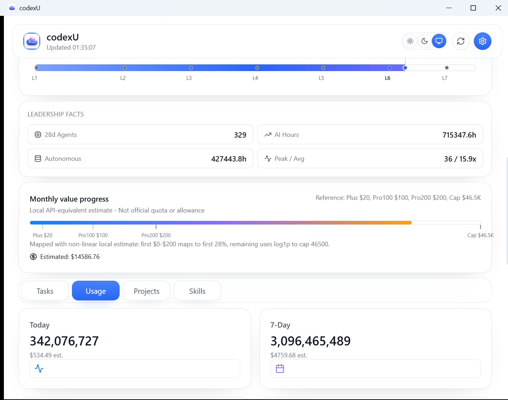
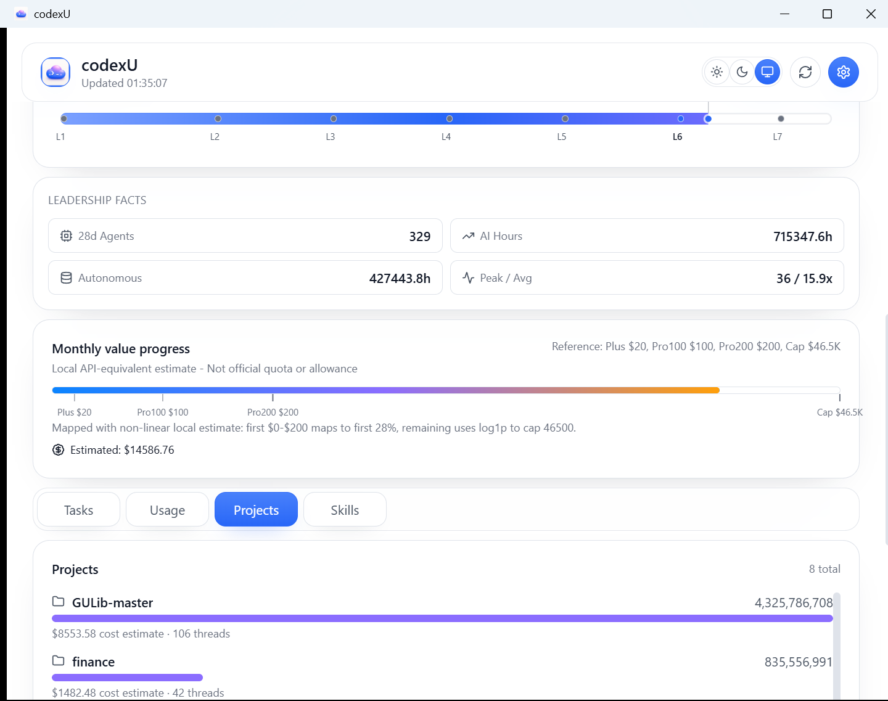
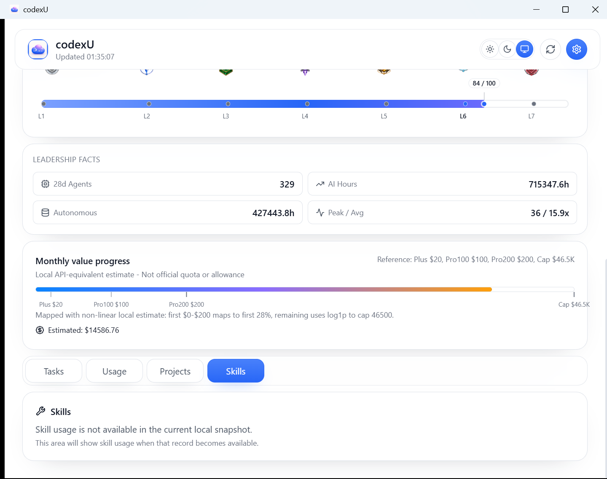

# macOS / Windows Dashboard Feature Comparison

- Evidence date: 2026-07-28
- Comparison rule: this is a hierarchy and evidence comparison, not a pixel, pricing, or capture-time-value comparison.

## Reading the comparison

| Label | Meaning |
| --- | --- |
| `fixed overview` | A fixed hierarchy block shown before lower-panel selection. |
| `variable panel` | A lower Dashboard panel selected from the four-tab area. |
| `complete shell / data blocked` | The native UI exists, but the current Windows contract intentionally does not expose the data needed to populate it. |
| `partial real panel` | A live local-data panel with related, not identical, macOS semantics. |

**Evidence boundary:** a blocked data field is not proof that the feature area is absent. It means the current Windows reader/model/IPC contract does not provide truthful source data for that content. No value in this document asks the UI to infer it.

## 1. Structure mapping

| macOS README structure | Windows Dashboard structure |
| --- | --- |
| Fixed dashboard overview, then variable areas for Tasks, Usage, Projects, and Skills | Fixed Dashboard: Leadership identity, local 7-day Token mix, Today/7-Day/Lifetime, L1-L7 rail, and local Month value progress. Then lower Tasks / Usage / Projects / Skills panels. |
| AI Leadership detail | Dedicated `AI Leadership` detail, not a fifth lower panel. |

Windows uses a native light/system Liquid Glass surface rather than copying the dark macOS pixels. Runtime values may differ; the comparison does not assert numeric equality.

## 2. Fixed overview

| macOS reference | Windows native evidence |
| --- | --- |
|  |  |

- Tag: `fixed overview`
- Windows fixed Dashboard contains the Leadership identity, local **7-day Token mix** (`Input`, `Cached input`, `Output`), Today / 7-day / Lifetime summaries, the full L1-L7 rail, and local Month value progress.
- Compact native evidence: at about `960x758` CSS pixels, three top groups remain horizontal and the rail title, badges, bar, and labels are all visible.
- The Token mix is local telemetry, not quota, remaining allowance, rate-limit data, or a bill. It has no duplicated count and the fixed top contains no raw thread, project, or tool content.

## 3. Variable panels in README order

### 3.1 Today / Tasks

| macOS | Windows |
| --- | --- |
|  |  |

- Tag: `variable panel` + `complete shell / data blocked`
- The Windows Tasks panel is implemented and truthfully explains that task state is not exposed by the current contract. It does **not** infer Tasks from Threads.

### 3.2 Usage

| macOS | Windows |
| --- | --- |
|  |  |

- Tag: `variable panel` + `partial real panel`
- Windows shows a real local-token usage surface. It does not claim macOS official-quota semantics.

### 3.3 Projects

| macOS | Windows |
| --- | --- |
|  |  |

- Tag: `variable panel` + `partial real panel`
- Windows shows a real local project surface at the same lower-panel level; its data presentation differs by host and contract.

### 3.4 Skills

| macOS | Windows |
| --- | --- |
|  |  |

- Tag: `variable panel` + `complete shell / data blocked`
- The Windows Skills panel is implemented and truthfully states that typed Skills usage is not exposed. **Tool usage is not mapped or relabelled as Skills.**

## 4. Month value progress interpretation

The fixed Windows Dashboard uses existing detailed-month `estimated_cost_usd` as a **local API-equivalent estimate**, not as an official monthly quota, allowance, remaining balance, or bill. Its markers are Plus `$20`, Pro 100 `$100`, Pro 200 `$200`, and a `$46.5K` reference cap; the first `$0–200` maps to 28%, then a `log1p` tail is used. macOS pricing differs, so the two platforms are not held to strict dollar parity.

## 5. Evidence files and conclusion

All six Windows images are final native HWND `PrintWindow` captures:

- [Fixed Dashboard](../reports/assets/dashboard-lower-panels-default-native.png)
- [AI Leadership](../reports/assets/dashboard-lower-panels-leadership-native.png)
- [Tasks](../reports/assets/dashboard-lower-panels-tasks-native.png)
- [Usage](../reports/assets/dashboard-lower-panels-usage-native.png)
- [Projects](../reports/assets/dashboard-lower-panels-projects-native.png)
- [Skills](../reports/assets/dashboard-lower-panels-skills-native.png)

The four lower-panel shots were captured after scrolling to the lower tablist: they prove the variable panels, not a first-screen claim. See [`WINDOWS_DASHBOARD_SHOWCASE.md`](WINDOWS_DASHBOARD_SHOWCASE.md) and [`WINDOWS_UI_PARITY_REPORT.md`](../reports/WINDOWS_UI_PARITY_REPORT.md) for capture dimensions, validation, and known limits.
