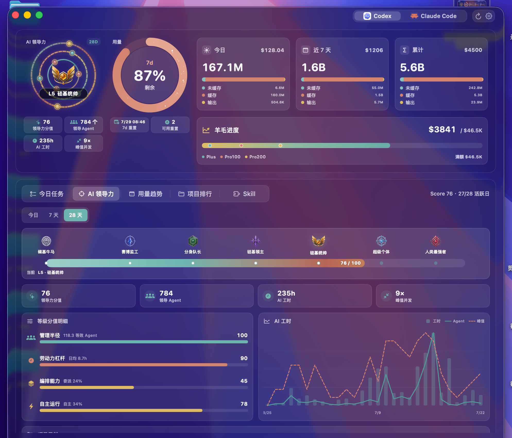
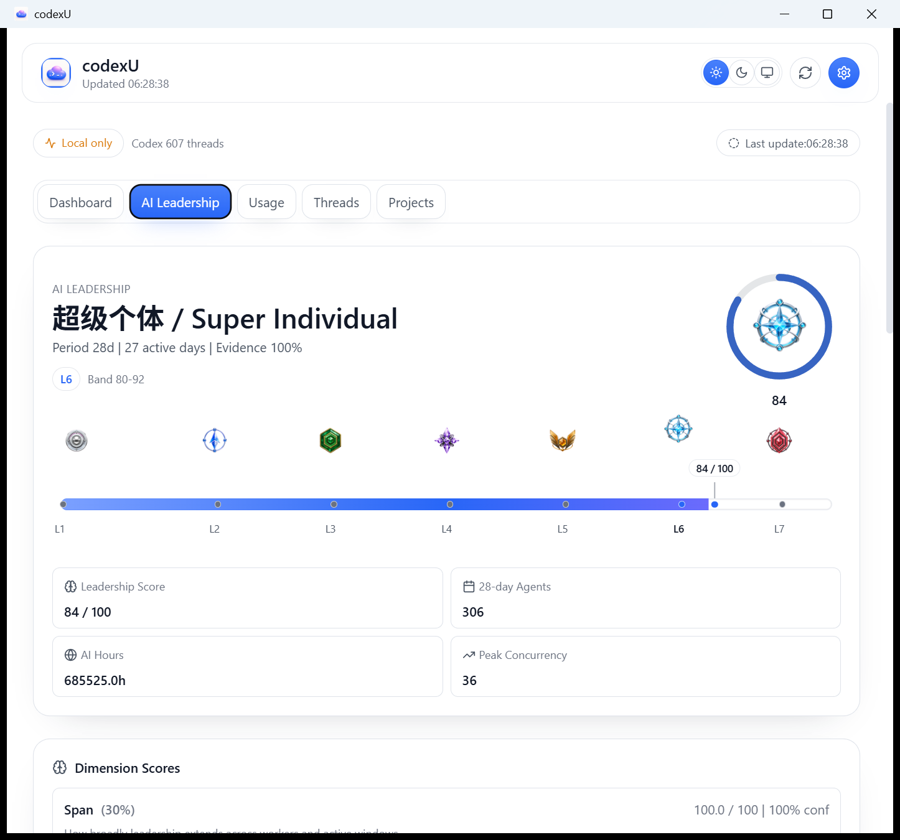
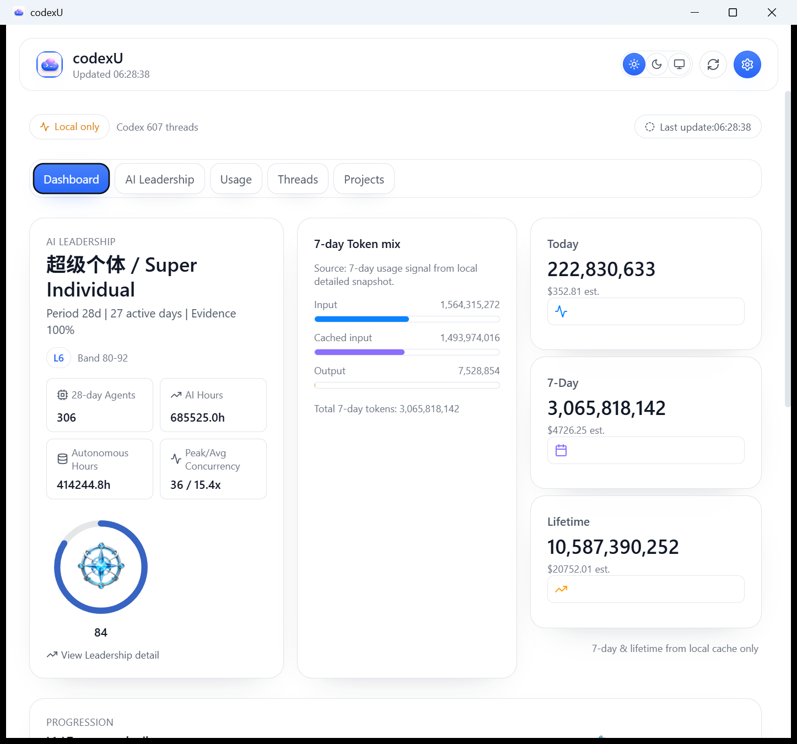
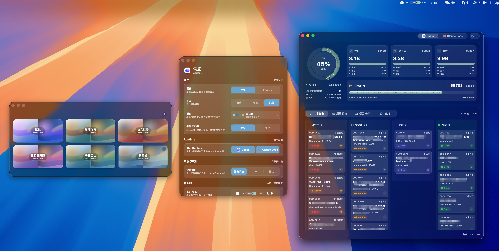

# macOS 与 Windows 功能对照 / 信息层级对齐报告

本报告为纯文档工作，聚焦 `docs` 与 `reports` 已有可审查证据，不包含源码、截图资产、数据接口或 Git 操作改动。对齐目标是信息层级与功能语义一致，而非像素级复刻。

## 结论与证据范围

- 3 项功能已形成对应对照：AI Leadership、Dashboard（含 Token mix）与 Palette/Settings。
- 统一证据边界：以 `docs/screenshot-v1.2.0-ai-leadership.png`、`docs/screenshot-v1.1.0-palette-gallery.png` 与 `docs/windows-port/reports/assets/*` 为准，未新增截图采集。
- 已有验收文档为依据：[`WINDOWS_DASHBOARD_SHOWCASE`](WINDOWS_DASHBOARD_SHOWCASE.md)、[`WINDOWS_DASHBOARD_SHOWCASE.html`](WINDOWS_DASHBOARD_SHOWCASE.html)、[`WINDOWS_UI_PARITY_REPORT`](../reports/WINDOWS_UI_PARITY_REPORT.md)、[`WINDOWS_UI_PARITY_REPORT.html`](../reports/WINDOWS_UI_PARITY_REPORT.html)。
- 对齐关系为“功能语义与信息优先级对齐”；平台风格差异（macOS 与 Windows）是预期保留，不在本次范围内。

## 1) AI Leadership：identity/score → L1-L7 → 2x2 metrics

| macOS 参考 | Windows 对比 |
| --- | --- |
|  |  |

- 对齐点：identity 与 score 语义同向；`L1-L7` 横向进度语义在 Windows 可见；领导力明细中保留 2×2 指标区块。
- 明确保留的差异：Windows 使用 light/system Liquid Glass 渲染，未追求暗色 macOS 像素镜像；macOS 仅为参考语义图，不是逐像素目标。
- 口径一致：可引用现有 canonical 阈值 `0/20/35/50/65/80/93`，当前 score 显示为 `L6`（若 score 为 84）。

## 2) Dashboard / Token mix：领导力优先、中心用量焦点、紧随进度/趋势

| macOS 参考（复用说明） | Windows 对比 |
| --- | --- |
|  |  |

- 对齐点：首页信息层级为“领导力摘要优先”→“中心用量焦点”→“进度/趋势衔接（progression 区）”。
- 明确保留的差异：`docs/screenshot-v1.2.0-ai-leadership.png` 同时承载 Leadership 与 Dashboard 参考信息层级，本报告再次引用该文件是**有意复用语义参考**，不是重复特性。
- 明确口径：Windows 首页底部 token mix 采用本地 7-day 命名与值域（Input/Cached input/Output），不与官方配额/remaining allowance 字段逐项同名同义，亦不将其宣称为同字段映射。
- 已知范围边界：未在本轮报告中引入 quota/remaining allowance 的官方契约截图或逐项字段一致性验收。

## 3) Settings：配色/入口与可读性层级可对比

| macOS 参考 | Windows 对比 |
| --- | --- |
|  |  |

- 对齐点：都能从设置链路理解“配色与设置入口”以及页面层级与可读性（标题/分区/选项）可比。
- 明确保留的差异：两端设置面板结构与控件全集不主张逐一一致，仅对比可见层级与信息组织方式。
- 已知差异范围：Windows 优先保持系统风格一致性；不做交互或字段逐项一致性声明。

## 为何不含 README 的 Today / Projects / Skills 历史截图

- 本轮仅采用了已存在、可复查、同范围内的证据文件；README 中的 Today/Projects/Skills 历史截图未在同一 Windows release 流程下同步采集。
- 该缺口是证据选择边界，不代表该功能缺失；如需补齐，需要新增同轮、同视角、同构建链路的 Windows 证据后再补入后续版本。

## 已知差异与可验证边界

- 对齐范围限于文档中出现的三条功能线，未执行像素级对比。
- Windows 用量命名在本页为**本地 7-day**语义，不能代替官方配额合约字段验证。
- README 源文件与源码内容、数据读取/缓存/IPC 与截图资产未变更（本任务不涉代码与数据链路）。
