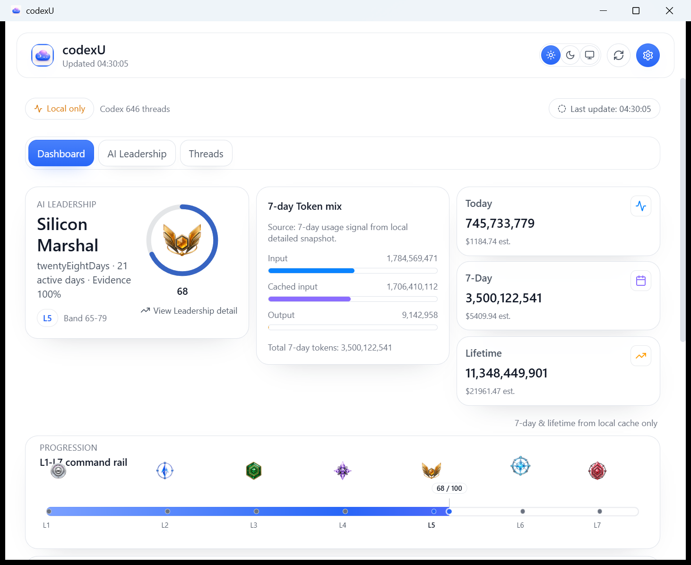
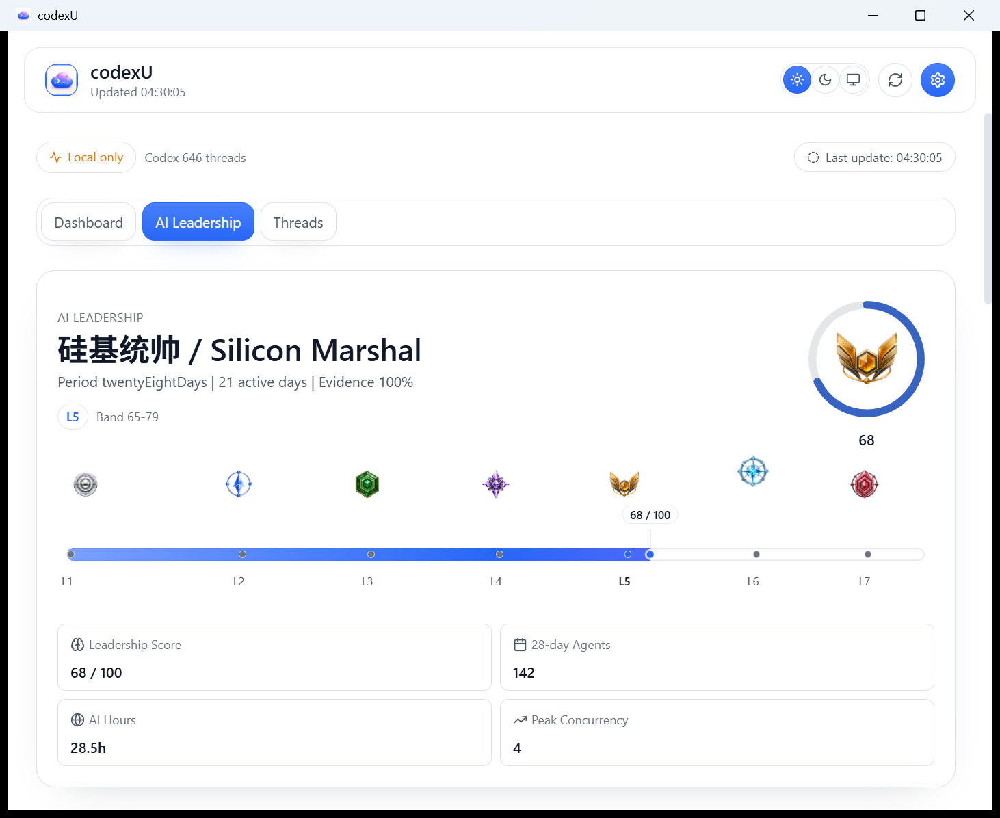
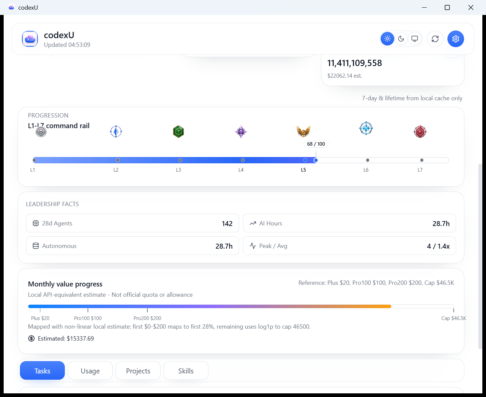

# macOS / Windows Dashboard Feature Comparison

- Evidence date: 2026-07-28
- Rule: hierarchy and evidence comparison only; not pixel, price, quota, or capture-time value parity.

## Current Windows boundary

Windows is an implemented **Codex-only** snapshot surface:

```text
local Codex sources -> CodexDashboardProvider -> CodexDashboardSnapshot
-> source-safe AppState / Tauri IPC -> web Dashboard
```

There is no active Claude provider or runtime selector. `RuntimeUsageSnapshot` is nested inside the Codex snapshot, local usage stays at `codex.snapshot.local`, and official quotas remain unavailable rather than simulated.

## Fixed overview and Leadership

| macOS reference | Current Windows evidence |
| --- | --- |
|  |  |

- **AI Leadership** corresponds to a `fixed overview` hierarchy; its detail is a drill-down, not one of the lower variable panels.
- The current default image is `1462x1196` physical / DPI 144, about `975x797 CSS px`, and shows exactly three global tabs plus a complete L1-L7 rail.
- Token mix values are local telemetry: `1,784,569,471` input + `1,706,410,112` cached input + `9,142,958` output = `3,500,122,541`. They appear once each, with no raw body content.
- Windows has a local Month estimate surface, but it is not strict evidence for macOS monthly Wool: source semantics, pricing, and Token mix meaning differ.

| macOS Leadership detail | Windows Leadership detail |
| --- | --- |
|  |  |

The Windows drill-down shows identity, score, rail, and metrics. Its score is an independent evidence-gated signal; absent evidence remains null/pending rather than becoming a guessed label.

## Lower panels: evidence boundary

The current native lower-navigation evidence is . At `1462x1196` physical pixels / DPI 144, it shows readable L1-L7, Month value explicitly labelled local API-equivalent estimate / not official quota, and one Tasks / Usage / Projects / Skills tab bar. It establishes that current navigation hierarchy only; it does not establish each variable panel's internal content or strict one-to-one macOS equivalence.

For strict cross-platform comparison, Tasks and Skills remain `variable panel + not implemented`: this label describes missing strict equivalence evidence only. It is not a conclusion about the full product area, source code, Reader, IPC, or roadmap. Tool usage is not relabelled as Skills.

## Validation

| Check | Result |
| --- | --- |
| `npm run build` | pass |
| `cargo test --workspace` | pass: 35 core + 7 Tauri tests |
| `cargo tauri build --no-bundle` | pass; release EXE built 2026-07-28 04:23:36 Asia/Shanghai |
| `git diff --check` | pass |
