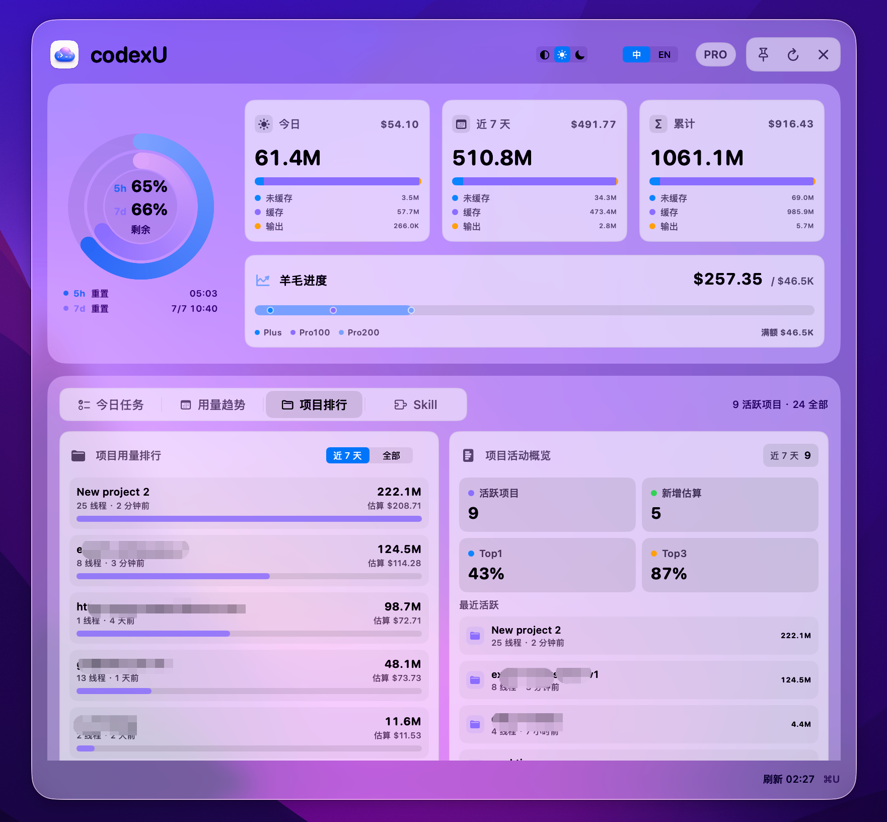
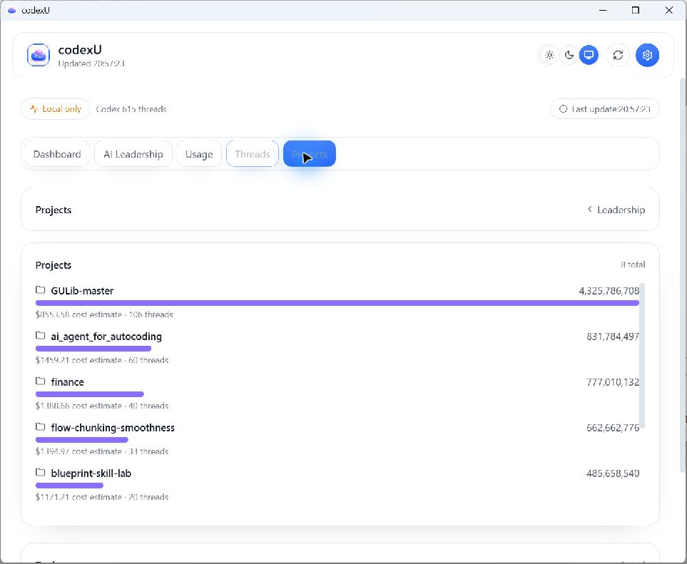
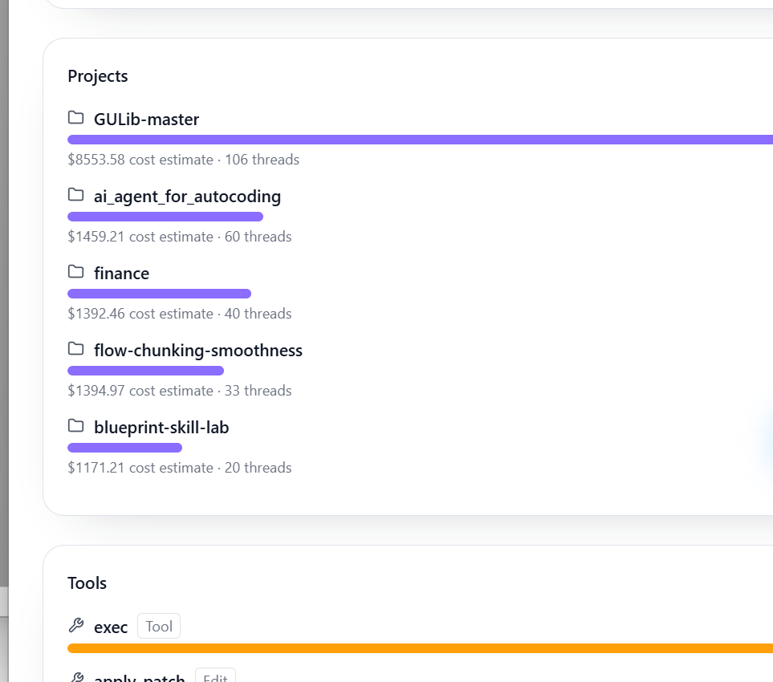
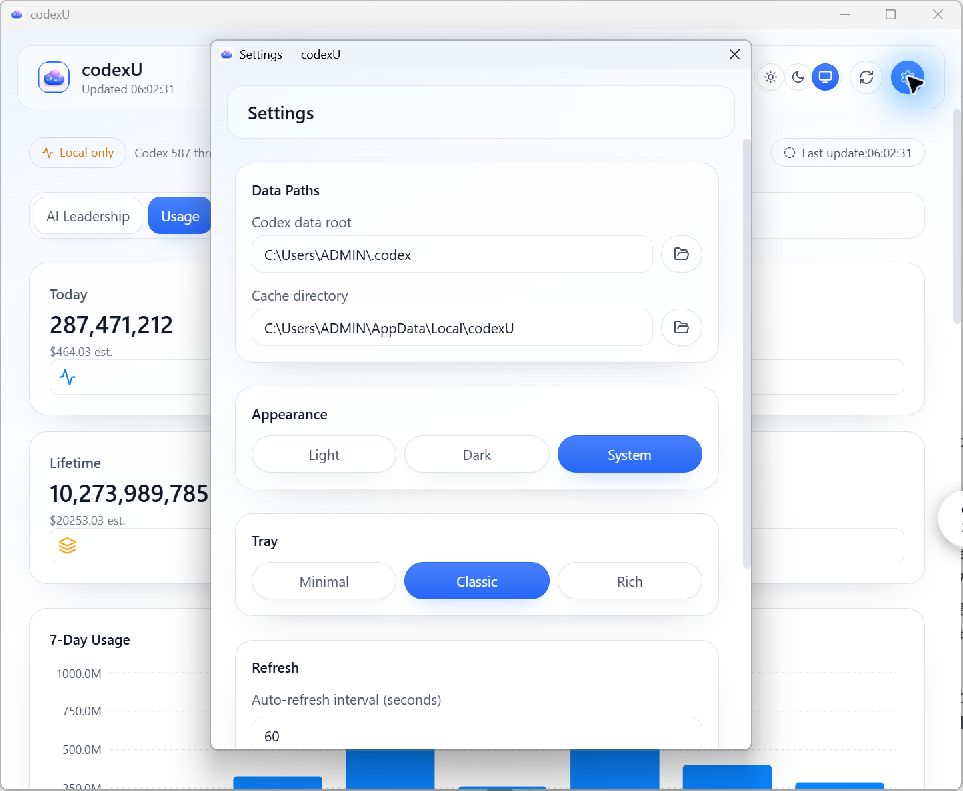

# macOS / Windows Dashboard 功能对照（非像素复刻）

该文档按 macOS `README` 截图顺序组织：AI Leadership、Today、Usage、Projects、Skills。
仅重排信息架构与状态标签，不做像素级对齐。

结论标签：`fixed overview`、`variable panel`、`partial`、`not implemented`、`outside Dashboard + partial`。

## 1. 信息结构（非 Mermaid）

```
[ 固定总览区 ]
macOS: Leadership + 配额/用量卡片 + 月度 Wool 进度
Windows: DashboardHome（Leadership + Token mix + Today/7-Day/Lifetime + rail）

          │ 结构上可对照
          ▼

[ 下层可变内容槽 ]
Tasks | Usage | Projects | Skills（macOS）
Windows: 当前 Leadership 为详情化独立页面，不并入四个下层可变项
```

## 2. 固定总览映射（fixed overview）

### 2.1 AI Leadership / Dashboard Overview

**状态：`fixed overview`**

| macOS | Windows |
| --- | --- |
|  |  |

- **差异边界**：Windows 采用 DashboardHome 总览，包含 Leadership、Token mix 与多类用量指标。
- **缺口说明**：Monthly Wool 在 Windows 当前无直接对应；Token mix 不能替代该指标。

## 3. 下层可变内容槽（按 README 顺序）

### 3.1 Tasks（variable panel + not implemented）

| macOS | Windows |
| --- | --- |
|  |  |

**状态：`variable panel` + `not implemented`**

Windows 仅提供 Today 用量度量，未提供独立任务面板。

### 3.2 Usage（variable panel + partial）

| macOS | Windows |
| --- | --- |
|  |  |

**状态：`variable panel` + `partial`**

Windows 与 macOS 均有用量信息，但展示口径和布局不完全同构，只能作为部分对应。

### 3.3 Projects（variable panel + partial）

| macOS | Windows |
| --- | --- |
|  |  |

**状态：`variable panel` + `partial`**

Windows 内容偏项目排行/邻近映射，存在语义重叠但非同一页面结构。

### 3.4 Skills（variable panel + not implemented）

| macOS | Windows |
| --- | --- |
|  |  |

**状态：`variable panel` + `not implemented`**

Windows 目前仅有 Tool usage 近似证据，独立 Skills 页面缺失。

## 4. 设置/配置（Dashboard 外层）`outside Dashboard + partial`

**状态：`outside Dashboard + partial`**

| macOS | Windows |
| --- | --- |
|  |  |

两端都存在配置相关入口，但不在 Dashboard 结构内一一同构；Windows Settings 存在且对得上“配置功能”，macOS 为 palette gallery，故标记为部分对应且在 Dashboard 外层。

## 5. 结论

- `AI Leadership` 为固定总览层级对应：有对应关系，但信息边界不同。
- `Tasks` 与 `Skills` 是 `variable panel + not implemented`（仅近似证据）。
- `Usage` 与 `Projects` 是 `variable panel + partial`。
- `Settings / Palette` 为 Dashboard 外层的 `outside Dashboard + partial`。
